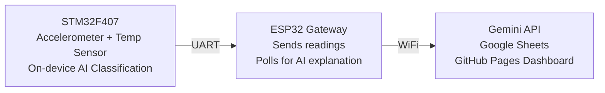

<div align="center">

# 🌀 SpinDoctor

### Real-Time Fault Detection for Rotating Machinery — AI on the Chip, Not the Cloud


<br/>

**Unplanned downtime from equipment failure costs manufacturers billions of dollars a year,<br/>and most of it is preventable if you catch the failure early enough.**

<br/>

[**🔴 Live Dashboard**](https://shrutik-kapatel.github.io/SpinDoctor/) &nbsp;·&nbsp; [**📘 Full Technical Writeup**](TECHNICAL.md) &nbsp;·&nbsp; [**⚡ Skills Demonstrated**](#-skills-demonstrated) &nbsp;·&nbsp; [**🏗️ Architecture**](#️-architecture-at-a-glance)

</div>

---

Industrial predictive maintenance solves this with vibration sensors and on-device AI, but building and testing that pipeline usually requires access to real production machinery. SpinDoctor proves out the same core approach end to end, real-time fault classification running entirely on embedded hardware, using a table fan as an accessible, safe stand-in for real rotating machinery.

It detects three states in real time: **healthy**, **blade imbalance**, and **obstruction**, classified entirely on-device with no cloud dependency for detection itself, then reports the result to a live dashboard and gets a plain-language explanation from an LLM.

<br/>

<table>
<tr>
<td width="38%" align="center">

<br/><sub>🔩 <b>Physical rig:</b> STM32F407 + LIS3DSH + DHT11 mounted on the test fan</sub>
</td>
<td width="62%" align="center">

<br/><sub>📊 <b>Live dashboard</b> with real-time digital twin</sub>
</td>
</tr>
</table>

<br/>

## 🎯 What It Does

A microcontroller mounted directly on a fan reads vibration (3-axis accelerometer) and temperature 400 times a second, runs a machine learning model on that data **on the chip itself**, and instantly knows if the fan is:

| State | Meaning |
|---|---|
|  | Running normally |
|  | A blade is off-balance, an early warning sign before real damage |
|  | Something is blocking or dragging on the fan |

No internet connection is needed for this detection to work, it happens entirely on the embedded chip in real time. Once a fault is detected, a second chip (ESP32) picks up the result over WiFi, asks an AI language model (Gemini) to explain what's happening in plain English, logs it, and streams it to a live web dashboard with a real-time animated "digital twin" of the fan.

<div align="center">

```
  Fan vibrates  →  Chip senses & classifies  →  Result explained by AI  →  Shown live on dashboard
```

</div>

<br/>

## 💡 Why This Project

> **Built solo. Built from scratch. Debugged for real.**

This was built as a solo capstone project to prove hands-on depth across the full embedded-to-cloud AI stack, not to follow a tutorial. Every layer here was built and debugged from scratch: bare-metal peripheral drivers, a real-time operating system, an on-device machine learning pipeline, a wireless gateway, and a cloud integration, wired together into one working system.

The project went through real engineering iteration along the way:

- ⚙️ A signal-processing approach that was built, validated, and deliberately retired once proven unnecessary
- 🔁 A model that misclassified under one operating condition, diagnosed, and fixed with a retrain
- 🐛 Several hard-to-reproduce bugs (a silent stack overflow, a UART/DMA conflict, a race condition corrupting network data) found through actual debugging tools, not guesswork

📘 The full engineering log, every decision, bug, and fix, is documented in **[TECHNICAL.md](TECHNICAL.md)**.

<br/>

## 🛠️ Skills Demonstrated

| Area | What was built |
|---|---|
| 🔧 **Embedded C / Bare-Metal** | Custom SPI+DMA driver for a 3-axis accelerometer at 400Hz, bit-banged microsecond-precision protocol for a temperature sensor, interrupt-driven UART with DMA-safe transmission |
| ⏱️ **Real-Time OS Design (FreeRTOS)** | 5-task priority architecture, mutex-protected shared state, semaphore-based inter-task signaling, watchdog-based fault recovery |
| 🧠 **On-Device Machine Learning (TinyML)** | Full pipeline from raw sensor capture to trained classifier to on-chip inference, model runs in under 3KB of RAM/flash with sub-millisecond inference time |
| 🔍 **Systematic Debugging** | Found and fixed a silent, hard-to-reproduce reset bug (a stack overflow with no visible crash) using a hardware debugger and live call-stack inspection, not trial and error |
| 📡 **Embedded Networking / IoT** | WiFi gateway on a second microcontroller, structured data handoff between two chips, REST API integration with a cloud LLM |
| ☁️ **Cloud & Backend Integration** | Google Sheets used as a lightweight backend via Apps Script, event-driven logging design to stay within API quotas |
| 🖥️ **Full-Stack / UX Thinking** | Live web dashboard with real-time data, an animated system status ("digital twin"), and offline/reconnect handling that reflects actual sensor state |

**Read the story behind each of these in [TECHNICAL.md](TECHNICAL.md).**

<br/>

## 🎬 See It In Action

<p align="center">
  
  <br/><sub>⚡ <b>Live classification:</b> obstruction detected, confidence and temperature shown in real time</sub>
</p>

The dashboard does more than display a label:

- 🌀 **Digital twin animation** — a 3D fan visualization that spins, wobbles, or stutters live based on the actual classified state, not a static icon
- 📴 **Offline detection** — if the fan goes silent for 90 seconds, the twin visibly winds down and the dashboard flags it as offline, rather than silently showing stale data as if it were live
- 🎥 **Cinematic reconnect** — when data resumes, the twin spins back up on screen in real time
- ⏪ **Replay mode** — a button that re-enacts the last 100 sensor readings end to end, useful for reviewing what happened without needing to be watching live

All 9 fault/speed combinations, plus a 10th test combining two faults simultaneously, were captured and verified. **Full results in [TECHNICAL.md](TECHNICAL.md#proof-of-work).**

<br/>

## 🏗️ Architecture at a Glance



Two chips split the work deliberately: the STM32 handles everything time-sensitive and safety-critical (sensing and classification) with zero dependency on connectivity, while the ESP32 only handles what actually needs the internet (AI explanation, logging, the live dashboard). If WiFi drops, fault detection keeps running uninterrupted, only the cloud-side extras pause.

**Full architecture, task design, and every bug found along the way: [TECHNICAL.md](TECHNICAL.md).**

<br/>

## 📊 Quick Facts

<div align="center">

| Metric | Value |
|---|---|
| 📈 **Sensor sampling rate** | 400 Hz (3-axis vibration) |
| 💾 **On-device model size** | Under 3 KB (RAM + flash combined) |
| ⚡ **Inference time** | ~0.3 ms per classification |
| 🎯 **Fault classes detected** | 3 (healthy, imbalance, obstruction) |
| ✅ **Test scenarios validated** | 10 (3 speeds × 3 fault classes, + 1 combined-fault test) |
| ☁️ **Cloud dependency for detection** | None, fully on-device |
| ⏲️ **End-to-end latency (sensor to dashboard)** | Near real-time |

</div>

<br/>

## 🔗 Links

<div align="center">

[](https://shrutik-kapatel.github.io/SpinDoctor/)
[](TECHNICAL.md)
[](your-linkedin-url-here)
[](your-portfolio-url-here)

</div>

---

<p align="center"><sub>Built solo by Shrutik Ka Patel as a capstone embedded systems + AI project.</sub></p>
