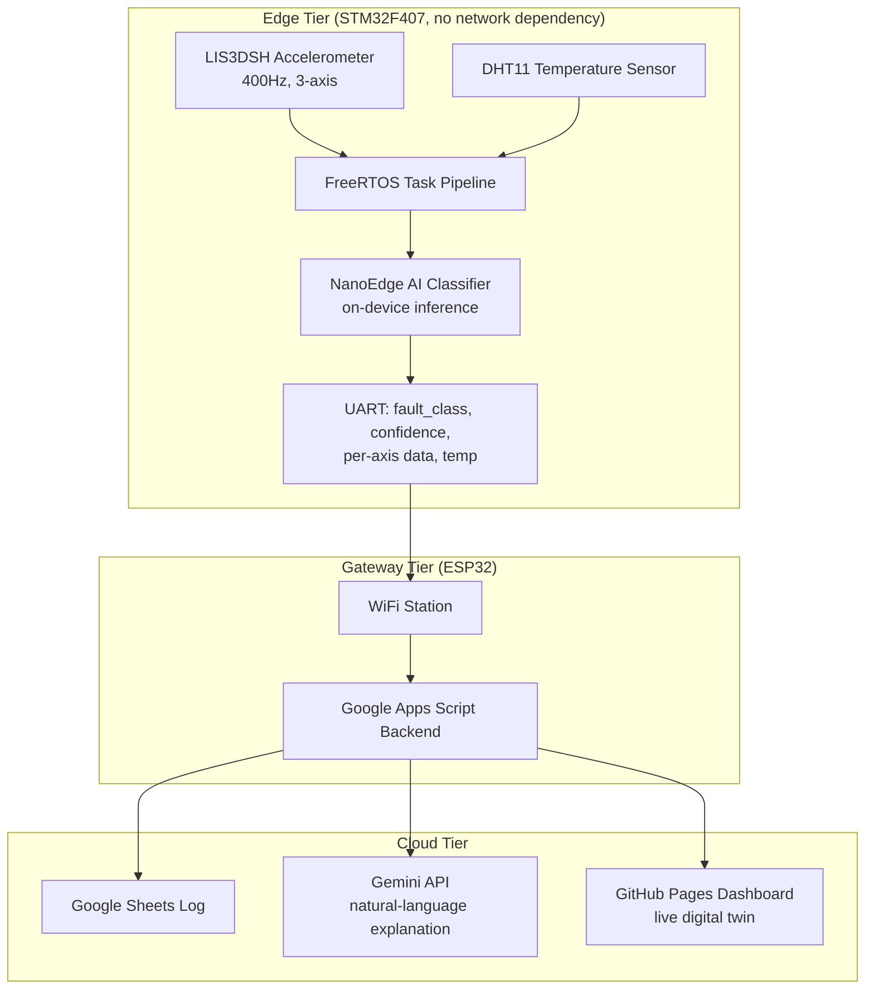
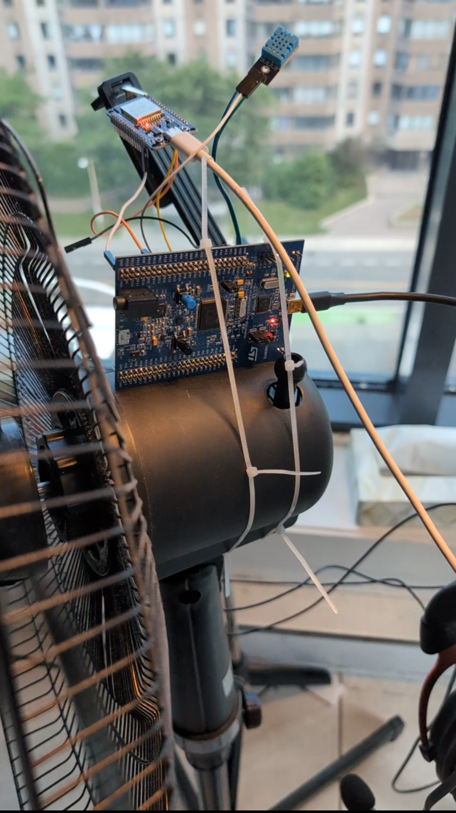

> ✍️ **Note:** This full technical writeup, covering every architecture decision, bug, and fix, is being finalized and will be published here shortly. The system itself is complete and the **[live dashboard](https://shrutik-kapatel.github.io/SpinDoctor/)** is up and running. An accompanying LinkedIn deep-dive is also on the way.

# SpinDoctor — Full Technical Writeup

*Coming soon. In the meantime, see the [project overview](README.md) and the [live dashboard](https://shrutik-kapatel.github.io/SpinDoctor/).*

# SpinDoctor: Technical Writeup

This document is the full engineering log for SpinDoctor: every architecture decision, bug found, and fix made, from raw sensor data to a deployed on-device AI model to a live cloud-connected dashboard.

For a high-level, recruiter-facing overview, see **[README.md](README.md)**.

## Table of Contents

1. [Overview](#overview)
2. [Architecture](#architecture)
3. [Hardware](#hardware)
4. [Groundwork Before the Capstone](#groundwork-before-the-capstone)
5. [Firmware Architecture (STM32 Side)](#firmware-architecture-stm32-side)
6. [The FFT Detour](#the-fft-detour)
7. [Hardening Arc](#hardening-arc)
8. [Data Capture Pipeline](#data-capture-pipeline)
9. [Model Training (NanoEdge AI Studio)](#model-training-nanoedge-ai-studio)
10. [On-Device Inference Integration](#on-device-inference-integration)
11. [ESP32 Gateway](#esp32-gateway)
12. [Cloud Integration: Gemini + Apps Script + Sheets](#cloud-integration-gemini--apps-script--sheets)
13. [Dashboard](#dashboard)
14. [Proof of Work](#proof-of-work)
15. [Known Limitations and What's Left](#known-limitations-and-whats-left)
16. [Lessons Learned](#lessons-learned)
17. [Repository Structure](#repository-structure)
18. [How to Build / Run It](#how-to-build--run-it)
19. [Appendix](#appendix)

---
## Overview

SpinDoctor is a two-tier edge-to-cloud predictive maintenance system. A table fan stands in for real rotating industrial machinery (motors, pumps, compressors), and the system detects three operating states in real time using only vibration and temperature data:

- **Healthy** - normal operation
- **Blade imbalance** - an early-stage mechanical fault, often the first sign of wear before real damage occurs
- **Obstruction** - something physically blocking or dragging on the fan

The core design constraint driving every decision in this project: **fault detection must work entirely on-device**, with zero dependency on network connectivity. The cloud layer (Gemini explanation, Google Sheets logging, live dashboard) exists to make the result useful to a human, but it is not on the critical path for detecting the fault itself. This mirrors how real industrial predictive maintenance systems are designed, edge sensors and controllers cannot depend on a live internet connection to keep machinery safe.

### System diagram

### Why a fan

Access to real industrial rotating equipment for iterative fault-injection testing isn't realistic for a solo capstone project. A table fan provides the same fundamental physics, a rotating mass whose vibration signature changes predictably under imbalance or obstruction, in a form that's safe, cheap to experiment on, and fast to iterate with. The sensor pipeline, model architecture, and edge/cloud split built here transfer directly to a real industrial sensor node; only the physical mounting and fault-injection method would change.
## Architecture

### The two-tier split

SpinDoctor is deliberately split into two independent compute tiers rather than one chip doing everything:

| | STM32F407 (Edge) | ESP32 (Gateway) |
|---|---|---|
| **Responsibility** | Sensing, classification, safety | Connectivity, cloud calls, logging |
| **Depends on network?** | No | Yes |
| **Runs an OS?** | FreeRTOS (real-time) | FreeRTOS (via ESP-IDF, best-effort) |
| **Failure mode if it goes down** | Fault detection stops entirely | Only explanations/dashboard/logging pause |

This split exists because these two jobs have fundamentally different reliability requirements. Classification has to run predictably, every sample, every window, regardless of whether WiFi is up, a coffee shop's router just rebooted, or an API is rate-limited. Networking, by contrast, is inherently best-effort, retries, timeouts, and occasional failures are normal and acceptable. Putting both on one chip would mean a WiFi hiccup could stall or jitter the time-critical sensing loop. Splitting them means the STM32 never even knows the network exists.

### Data flow

1. **LIS3DSH** streams 3-axis acceleration via SPI+DMA at 400Hz, triggered by a data-ready interrupt
2. **DHT11** streams temperature on a slower, independent cycle
3. Both feed into a **FreeRTOS task pipeline** on the STM32 (full detail in [Section 5](#firmware-architecture-stm32-side))
4. Every 64-sample window, the on-device **NanoEdge AI classifier** produces a fault class and confidence score
5. The result, plus raw per-axis data and temperature, is packed into a JSON line and sent over **UART** to the ESP32
6. The ESP32 forwards this to a **Google Apps Script** backend, which logs it to **Google Sheets** and, on request, asks **Gemini** for a plain-language explanation
7. A **GitHub Pages dashboard** polls the Sheets backend and renders the live state, including a real-time animated "digital twin" of the fan

### Why UART between the two chips

A direct wired UART link (rather than, say, both chips on the same WiFi network talking over sockets) was chosen so the STM32's output is a single, simple, always-available interface regardless of the ESP32's network state. The STM32 doesn't need to know if the ESP32 is connected, booted, or even present, it just writes to UART. This decision is what makes the "STM32 doesn't know the network exists" property in the table above actually true, not just aspirational.
## Hardware

### Components

| Component | Role |
|---|---|
| **STM32F407G-DISC1** (STM32F407VGT6, Cortex-M4) | Edge compute: sensing, FreeRTOS, on-device AI inference |
| **LIS3DSH** (onboard the Discovery board) | 3-axis MEMS accelerometer, vibration sensing |
| **DHT11** | Digital temperature/humidity sensor |
| **ESP32-WROOM-32D** (30-pin, CP2102 breakout) | WiFi gateway, cloud integration |
| **Onboard ST-LINK** | Primary programmer/debugger for all SpinDoctor firmware work, including the stack overflow investigation ([Section 7](#hardening-arc)) |
| **SEGGER J-Link Pro** | Thread-aware debugging used during pre-capstone bring-up and mini-projects ([Section 4](#groundwork-before-the-capstone)), where FreeRTOS thread-aware debugging skills were built before the capstone began |
| **Comidox CP317 Logic Analyzer** | Protocol-level verification during bring-up |

### Physical setup

The STM32F407G-DISC1 board is mounted directly on the fan housing, with the LIS3DSH accelerometer (built into the Discovery board) rigidly coupled to the fan body so it picks up the fan's actual mechanical vibration rather than an isolated, dampened signal. The DHT11 is mounted nearby to sense ambient/motor-adjacent temperature.

  

Fault states were physically induced on the same fan rather than simulated in software:
- **Blade imbalance**: a small weight added asymmetrically to one blade, shifting the rotational mass distribution
- **Obstruction**: a physical object introduced to partially block or drag on the blade path during rotation

Both fault types were tested across all 3 fan speed settings, since vibration signature strength scales with RPM, this is what surfaced the low-speed classification issue discussed in [Section 9](#model-training-nanoedge-ai-studio).

### Wiring

- **LIS3DSH**: onboard, connected internally via SPI1 (no external wiring required)
- **DHT11**: single-wire bit-banged data line on **PB6**, timing handled via the ARM DWT cycle counter for microsecond-accurate pulse measurement
- **STM32 → ESP32 link**: USART3, **PB10 (TX)** → ESP32 **GPIO16 (RX)**, and **PB11 (RX)** ← ESP32 **GPIO17 (TX)**
  - USART3 was chosen specifically over USART1 to avoid a pin conflict with the Discovery board's onboard audio codec, which shares pins with USART1 in this board's default configuration

## Groundwork Before the Capstone

SpinDoctor wasn't the starting point, it was built after a deliberate skill-building phase, kept in a separate practice repository so the capstone repo stays focused and standalone.

### STM32 and RTOS fundamentals

A series of STM32 practice projects were completed first, covering peripheral-level fundamentals (GPIO, timers, SPI, I2C, UART, ADC/DMA) primarily using the STM32 HAL, followed by a full FreeRTOS curriculum covering task design, synchronization primitives, and **thread-aware debugging using a SEGGER J-Link Pro**, pausing execution and inspecting live task state and call stacks rather than relying on print statements alone. This debugging skill was applied directly during the capstone's own stack overflow investigation ([Section 7](#hardening-arc)), just using the onboard ST-LINK at that stage instead.

### Structured bring-up sequence

Before SpinDoctor integration began, a structured sequence of mini-projects was completed to validate each subsystem in isolation before combining them, sensor bring-up, peripheral drivers, and FreeRTOS subsystem validation, each proven working independently before being integrated into the more complex multi-task system.

This sequencing matters for one reason: every peripheral driver used in SpinDoctor (SPI+DMA, bit-banged timing, interrupt-driven UART) was already validated independently, in isolation, before being integrated into the more complex multi-task FreeRTOS system. When something broke during capstone integration, it was reasonable to assume the bug was in the integration, not in a peripheral driver seeing real hardware for the first time.
## Firmware Architecture (STM32 Side)

### Why FreeRTOS

Five things need to happen concurrently on one chip: sample vibration at 400Hz without ever missing a sample, read temperature on a slow independent cycle, feed a live capture menu over UART, run on-device inference on completed windows, and guarantee the system recovers if anything hangs. A bare superloop makes it very easy for a slow operation (a print, a sensor read with a timeout) to delay something time-critical. FreeRTOS lets each concern run as its own task with its own priority, so the scheduler, not hand-written timing logic, guarantees the accelerometer path is never starved.

### One-time boot sequence

Before the FreeRTOS scheduler starts, `main()` runs sequentially:

1. **HAL_Init()** and **SystemClock_Config()** - core init, PLL configured to 168MHz
2. **Peripheral init** - GPIO, DMA, SPI1, USART2/3, ADC1, IWDG
3. **LIS3DSH init** - ODR set to 400Hz, axis enable, DRDY interrupt routing configured so the sensor itself pulses an interrupt pin on every new sample
4. **DWT cycle counter enabled** - required for microsecond-accurate delays used by the DHT11 bit-banged protocol; forgetting this silently hangs that task forever with no error, since there's no fault, just a task that never returns from a wait loop
5. **NanoEdge AI classifier init** - loads the trained model, must succeed before any inference call is valid
6. **FreeRTOS objects created** - all mutexes, semaphores, and tasks are created here, but nothing runs yet
7. **Semaphore draining** - a CMSIS-RTOS V1 quirk creates `captureDataReadyHandle` with an initial token already set; this is drained immediately so tasks correctly block on their *first* wait instead of running once against garbage data
8. **osKernelStart()** - hands control to FreeRTOS; `main()` never returns from here

## Firmware Architecture (STM32 Side)

### Why FreeRTOS

Five things need to happen concurrently on one chip: sample vibration at 400Hz without ever missing a sample, read temperature on a slow independent cycle, feed a live capture menu over UART, run on-device inference on completed windows, and guarantee the system recovers if anything hangs. A bare superloop makes it very easy for a slow operation (a print, a sensor read with a timeout) to delay something time-critical. FreeRTOS lets each concern run as its own task with its own priority, so the scheduler, not hand-written timing logic, guarantees the accelerometer path is never starved.

### One-time boot sequence

Before the FreeRTOS scheduler starts, `main()` runs sequentially:

1. **HAL_Init()** and **SystemClock_Config()** - core init, PLL configured to 168MHz
2. **Peripheral init** - GPIO, DMA, SPI1, USART2/USART3, ADC1, IWDG
3. **LIS3DSH init** - ODR set to 400Hz, axis enable, then a second explicit register write routes DRDY to INT1/PE0; without this second step the chip never pulses PE0 and the EXTI interrupt never fires at all
4. **DWT cycle counter enabled** - required for microsecond-accurate delays used by the DHT11 bit-banged protocol; forgetting this silently hangs that task forever with no crash, just a task that never returns from a wait loop
5. **ADC1 started in circular DMA mode** - from this point, temperature-sensor raw readings update automatically in hardware with no further software trigger
6. **Interrupt-driven UART receive armed** - `HAL_UART_Receive_IT` is started for the capture menu before the scheduler even starts, since blocking-mode receive doesn't coexist safely with DMA-based transmit already active on the same UART
7. **NanoEdge AI classifier init** - loads the trained model; if this fails, the system halts in `Error_Handler()` rather than running with an uninitialized classifier
8. **FreeRTOS objects created** - all mutexes, semaphores, and tasks are created here, but nothing runs yet
9. **Both capture semaphores drained** - a CMSIS-RTOS V1 quirk creates semaphores with an initial token already set; `captureDataReadyHandle` and `captureRxByteReadyHandle` are both drained immediately so their respective tasks correctly block on their *first* wait instead of running once against garbage data
10. **Thread creation checked** - each `osThreadCreate()` return value is checked for `NULL`; a failure reports directly over blocking UART, bypassing the mutex/DMA-based print path entirely, since if RTOS object creation itself is failing, the mutex and DMA infrastructure it depends on can't be trusted either
11. **osKernelStart()** - hands control to FreeRTOS; `main()` never returns from here

### Task architecture

| Task | Priority | Stack (words) | Responsibility |
|---|---|---|---|
| **AccelTask** | Normal (highest) | 512 | Polls a data-ready flag set by the SPI/DMA interrupt chain, fills ping-pong capture buffers, signals when a full window is ready |
| **CaptureTask** | Below Normal | 512 | Runs the interactive UART menu used to select fan speed/fault class and record training data |
| **InferenceTask** | Below Normal | 1024 | Runs the on-device classifier on each completed sample window and reports the result |
| **DHT11Task** | Low | 256 | Bit-banged temperature read every 3s; purely informational |
| **WatchdogTask** | Low | 512 | Refreshes the IWDG watchdog every 500ms |

Most of this ordering follows a clear rule: priority is assigned by how time-sensitive the data is. Missing an accelerometer sample corrupts a window and potentially the classification, so AccelTask runs highest. Temperature is slow-moving, informational context, so DHT11Task runs lowest.

**One inconsistency worth naming honestly:** the watchdog pattern from earlier practice work was explicitly designed with the watchdog task running at a *higher* priority than the tasks it's meant to catch, the reasoning being that a runaway task at equal or higher priority could starve the watchdog out entirely, defeating its purpose. In SpinDoctor, `WatchdogTask` ended up at `osPriorityLow`, tied with `DHT11Task`, contradicting that earlier principle. This wasn't a deliberate re-decision, it's a byproduct of assigning the other four tasks their priorities first and the watchdog landing wherever was left. It currently works because no task in this system has actually starved the scheduler long enough to expose the gap, but it's a known latent risk, and the honest fix would be raising `WatchdogTask` above every worker task it's meant to protect against.

### How a sample actually moves through the system

The LIS3DSH pulses its DRDY pin on an external interrupt line every ~2.5ms (400Hz). That interrupt starts a burst SPI read over DMA: a 1-byte address transmit, whose completion callback starts a 6-byte data receive, whose completion callback reconstructs X/Y/Z and sets a `LIS3_DataReady` flag. None of this blocks any task. AccelTask itself runs a loop polling that flag with `osDelay(1)` between checks, so the expensive part (the actual SPI transaction) happens entirely in interrupt/DMA context, and the task only does lightweight bookkeeping: writing the sample into the current ping-pong buffer (`capture_buf_x/y/z[2][64]`), and once every 64 samples, releasing `captureDataReadyHandle` to signal a complete window downstream. This buffer fill and semaphore release happen unconditionally on every sample, whether or not a training capture is active, since both CaptureTask (during capture) and InferenceTask (during normal operation) need a continuous, uninterrupted stream of windows. A separate `capture_active` flag only gates whether AccelTask also prints a throttled diagnostic line, it does not gate whether data flows into the shared buffer.

### Mutexes

- **`diagnosticsMutexHandle`** - protects a shared diagnostics struct. AccelTask and DHT11Task write to it (accelerometer values, temperature/humidity); InferenceTask reads the temperature back out of it when building the JSON payload sent to the ESP32. Held only for the duration of the actual struct access, never across a slow call like a print.
- **`printfMutexHandle`** - protects the underlying print call and the C library's internal formatting state, which is not safe to call from two tasks at once; without this, two tasks printing near-simultaneously produced visibly corrupted, interleaved output during development. Deliberately **not** used inside `vApplicationStackOverflowHook`, that handler uses direct blocking `HAL_UART_Transmit` instead, because the offending task's stack may already be corrupted, and taking a mutex plus routing through printf's formatting would push more onto that same compromised stack before the message can get out.

### Semaphores

- **`uartTxSemaphoreHandle`** - serializes UART DMA transmissions so only one transfer is ever in flight; released by the transfer-complete interrupt callback. `_write()` (the function `printf` ultimately calls) waits on it, starts the DMA transfer, then waits on it again with a **bounded 200ms timeout**, not `osWaitForever`, so a stuck transfer surfaces as a single dropped line instead of freezing every future `printf` call in the system. This semaphore is strictly paired with DMA-mode transmission only; a blocking-mode transmit call must never touch it, since blocking mode never fires the completion callback that releases it, which would permanently consume a token that's never returned.
- **`captureDataReadyHandle`** - signals that a full sample window is ready in the ping-pong buffer; both CaptureTask and InferenceTask wait on it, with the `capture_active` flag determining which one is the intended consumer at any given moment (InferenceTask skips and loops again if a capture session owns the data).
- **`captureRxByteReadyHandle`** - signals that a byte has arrived over UART, used by CaptureTask to block on user input during the training-data capture menu without busy-waiting.

### A design principle worth naming

Task stack sizes and FreeRTOS configuration are treated as living tuning parameters, not fixed at design time. Every task's stack size in this project was revised at least once after real evidence (a stack overflow, see [Section 7](#hardening-arc)) rather than guessed upfront and left alone. CubeMX's `.ioc` file is kept as the single source of truth for these values, rather than hand-editing generated config headers directly.
