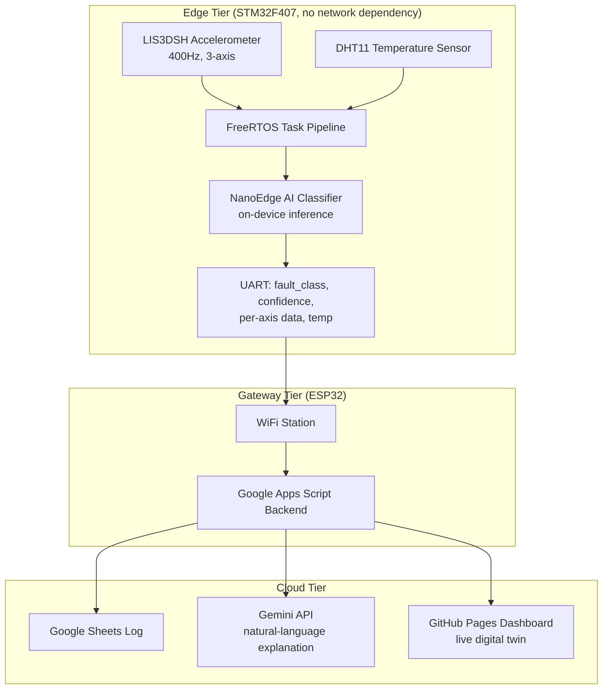

> ✍️ **Note:** This full technical writeup, covering every architecture decision, bug, and fix, is being finalized and will be published here shortly. The system itself is complete and the **[live dashboard](https://shrutik-kapatel.github.io/SpinDoctor/)** is up and running. An accompanying LinkedIn deep-dive is also on the way.

# SpinDoctor: Technical Writeup

This document is the full engineering log for SpinDoctor: every architecture decision, bug found, and fix made, from raw sensor data to a deployed on-device AI model to a live cloud-connected dashboard.

For a high-level, recruiter-facing overview, see **[README.md](README.md)**.

## Table of Contents

1. [Overview](#overview)
2. [Architecture](#architecture)
3. [Hardware](#hardware)
4. [Groundwork Before the Capstone](#groundwork-before-the-capstone)
5. [Firmware Architecture (STM32 Side)](#firmware-architecture-stm32-side)
6. [The FFT Detour](#the-fft-detour)
7. [Hardening Arc](#hardening-arc)
8. [Data Capture Pipeline](#data-capture-pipeline)
9. [Model Training (NanoEdge AI Studio)](#model-training-nanoedge-ai-studio)
10. [On-Device Inference Integration](#on-device-inference-integration)
11. [ESP32 Gateway](#esp32-gateway)
12. [Cloud Integration: Gemini + Apps Script + Sheets](#cloud-integration-gemini--apps-script--sheets)
13. [Dashboard](#dashboard)
14. [Proof of Work](#proof-of-work)
15. [Known Limitations and What's Left](#known-limitations-and-whats-left)
16. [Lessons Learned](#lessons-learned)
17. [Repository Structure](#repository-structure)
18. [How to Build / Run It](#how-to-build--run-it)
19. [Appendix](#appendix)

---

## Overview

SpinDoctor is a two-tier edge-to-cloud predictive maintenance system. A table fan stands in for real rotating industrial machinery (motors, pumps, compressors), and the system detects three operating states in real time using only vibration and temperature data:

- **Healthy** - normal operation
- **Blade imbalance** - an early-stage mechanical fault, often the first sign of wear before real damage occurs
- **Obstruction** - something physically blocking or dragging on the fan

The core design constraint driving every decision in this project: **fault detection must work entirely on-device**, with zero dependency on network connectivity. The cloud layer (Gemini explanation, Google Sheets logging, live dashboard) exists to make the result useful to a human, but it is not on the critical path for detecting the fault itself. This mirrors how real industrial predictive maintenance systems are designed, edge sensors and controllers cannot depend on a live internet connection to keep machinery safe.

### System diagram



### Why a fan

Access to real industrial rotating equipment for iterative fault-injection testing isn't realistic for a solo capstone project. A table fan provides the same fundamental physics, a rotating mass whose vibration signature changes predictably under imbalance or obstruction, in a form that's safe, cheap to experiment on, and fast to iterate with. The sensor pipeline, model architecture, and edge/cloud split built here transfer directly to a real industrial sensor node; only the physical mounting and fault-injection method would change.

## Architecture

### The two-tier split

SpinDoctor is deliberately split into two independent compute tiers rather than one chip doing everything:

| | STM32F407 (Edge) | ESP32 (Gateway) |
|---|---|---|
| **Responsibility** | Sensing, classification, safety | Connectivity, cloud calls, logging |
| **Depends on network?** | No | Yes |
| **Runs an OS?** | FreeRTOS (real-time) | FreeRTOS (via ESP-IDF, best-effort) |
| **Failure mode if it goes down** | Fault detection stops entirely | Only explanations/dashboard/logging pause |

This split exists because these two jobs have fundamentally different reliability requirements. Classification has to run predictably, every sample, every window, regardless of whether WiFi is up, a coffee shop's router just rebooted, or an API is rate-limited. Networking, by contrast, is inherently best-effort, retries, timeouts, and occasional failures are normal and acceptable. Putting both on one chip would mean a WiFi hiccup could stall or jitter the time-critical sensing loop. Splitting them means the STM32 never even knows the network exists.

### Data flow

1. **LIS3DSH** streams 3-axis acceleration via SPI+DMA at 400Hz, triggered by a data-ready interrupt
2. **DHT11** streams temperature on a slower, independent cycle
3. Both feed into a **FreeRTOS task pipeline** on the STM32 (full detail in [Section 5](#firmware-architecture-stm32-side))
4. Every 64-sample window, the on-device **NanoEdge AI classifier** produces a fault class and confidence score
5. The result, plus raw per-axis data and temperature, is packed into a JSON line and sent over **UART** to the ESP32
6. The ESP32 forwards this to a **Google Apps Script** backend, which logs it to **Google Sheets** and, on request, asks **Gemini** for a plain-language explanation
7. A **GitHub Pages dashboard** polls the Sheets backend and renders the live state, including a real-time animated "digital twin" of the fan

### Why UART between the two chips

A direct wired UART link (rather than, say, both chips on the same WiFi network talking over sockets) was chosen so the STM32's output is a single, simple, always-available interface regardless of the ESP32's network state. The STM32 doesn't need to know if the ESP32 is connected, booted, or even present, it just writes to UART. This decision is what makes the "STM32 doesn't know the network exists" property in the table above actually true, not just aspirational.

## Hardware

### Components

| Component | Role |
|---|---|
| **STM32F407G-DISC1** (STM32F407VGT6, Cortex-M4) | Edge compute: sensing, FreeRTOS, on-device AI inference |
| **LIS3DSH** (onboard the Discovery board) | 3-axis MEMS accelerometer, vibration sensing |
| **DHT11** | Digital temperature/humidity sensor |
| **ESP32-WROOM-32D** (30-pin, CP2102 breakout) | WiFi gateway, cloud integration |
| **Onboard ST-LINK** | Primary programmer/debugger for all SpinDoctor firmware work, including the stack overflow investigation ([Section 7](#hardening-arc)) |
| **SEGGER J-Link Pro** | Thread-aware debugging used during pre-capstone bring-up and mini-projects ([Section 4](#groundwork-before-the-capstone)) |
| **Comidox CP317 Logic Analyzer** | Protocol-level verification during bring-up |

### Physical setup and axis mapping

The STM32F407G-DISC1 board is mounted on the fan's rear motor housing via zip ties, behind the blade guard. The initial mount used a sponge as a gap-filler between the board and the curved housing surface. This sponge was removed during hardware iteration ([Section 9](#model-training-nanoedge-ai-studio)), alongside a firmware fix for a stack overflow bug, as part of resolving a speed 1 fault detection failure. The board is now direct-mounted against the housing with no compliant material in the vibration path, held only by the zip ties.

<p align="center">
  
</p>

The accelerometer's axis mapping was derived empirically rather than trusted from the datasheet's reference diagram, since the board ended up mounted at an orientation that didn't match the originally planned "short edge down," and tracing orientation visually off a datasheet diagram on a curved, zip-tied mount wasn't reliable. Instead, the whole fan assembly was tilted by hand in known directions while reading live X/Y/Z values over UART:

| Fan state | X | Y | Z |
|---|---|---|---|
| Rest (fan off) | ~13900 | ~3320 | ~955 |
| Tilted backward | drops modestly | swings hardest (+~6000) | flips sign |
| Tilted left | near baseline | near baseline | swings hard positive (+~7000) |
| Tilted right | near baseline | near baseline | swings hard negative (-~9000) |

This gave a working mapping: **X** behaves as a magnitude/residual axis (doesn't cleanly discriminate direction), **Y** tracks pitch (forward/backward), **Z** tracks lean (left/right) and gives the cleanest, strongest signal of the three.

### Fault induction

Fault states were physically induced on the same fan rather than simulated in software:
- **Blade imbalance**: a small weight added asymmetrically to one blade, shifting the rotational mass distribution
- **Obstruction**: a physical object introduced to partially block or drag on the blade path during rotation

Both fault types were tested across all 3 fan speed settings, since vibration signature strength scales with RPM, this is what surfaced the low-speed classification issue discussed in [Section 9](#model-training-nanoedge-ai-studio).

### A sensor that was descoped: RPM via Hall sensor

An earlier design included direct RPM sensing via Timer Input Capture, reading pulses from a Hall sensor and a magnet mounted on a fan blade. The capture logic itself worked correctly in isolation, but the physical mounting proved fundamentally impractical: any magnet large enough for reliable detection introduced a real, physically significant rotor imbalance at the blade radius. Moving the magnet closer to the hub to reduce that imbalance made detection worse, since the smaller radius meant less surface area and a weaker signal. At higher fan speeds, the resulting imbalance was severe enough to make the entire fan assembly walk across the surface it was sitting on.

RPM sensing was deliberately descoped rather than pursued further: the accelerometer alone already provides a complete fault signal for all three target classes via vibration, and RPM was only ever intended as a secondary correlating signal, not a load-bearing one for classification. A working RPM implementation is preserved on a separate branch outside the main integrated firmware, in case it's worth revisiting later.

### Wiring

- **LIS3DSH**: onboard, connected internally via SPI1 (no external wiring required)
- **DHT11**: single-wire bit-banged data line on **PB6**, timing handled via the ARM DWT cycle counter for microsecond-accurate pulse measurement. (This pin was originally intended for a different, dedicated motor-adjacent temperature sensor; that part turned out to not actually be in inventory, confirmed via a UART-only diagnostic that sampled the data line after a reset pulse and printed the raw response, which came back flat. Pivoted to the DHT11, already on hand with a proven driver from earlier bring-up work.)
- **STM32 → ESP32 link**: USART3, **PB10 (TX)** → ESP32 **GPIO16 (RX)**, and **PB11 (RX)** ← ESP32 **GPIO17 (TX)**
  - USART3 was chosen specifically over USART1 to avoid a pin conflict with the Discovery board's onboard audio codec, which shares pins with USART1 in this board's default configuration

## Groundwork Before the Capstone

SpinDoctor wasn't the starting point, it was built after a deliberate skill-building phase, kept in a separate practice repository so the capstone repo stays focused and standalone.

### STM32 and RTOS fundamentals

A series of STM32 practice projects were completed first, covering peripheral-level fundamentals (GPIO, timers, SPI, I2C, UART, ADC/DMA) primarily using the STM32 HAL, followed by a full FreeRTOS curriculum covering task design, synchronization primitives, and **thread-aware debugging using a SEGGER J-Link Pro**, pausing execution and inspecting live task state and call stacks rather than relying on print statements alone. This debugging skill was applied directly during the capstone's own stack overflow investigation ([Section 7](#hardening-arc)), just using the onboard ST-LINK at that stage instead.

### Structured bring-up sequence

Before SpinDoctor integration began, a structured sequence of mini-projects was completed to validate each subsystem in isolation before combining them, sensor bring-up, peripheral drivers, and FreeRTOS subsystem validation, each proven working independently before being integrated into the more complex multi-task system.

This sequencing matters for one reason: every peripheral driver used in SpinDoctor (SPI+DMA, bit-banged timing, interrupt-driven UART) was already validated independently, in isolation, before being integrated into the more complex multi-task FreeRTOS system. When something broke during capstone integration, it was reasonable to assume the bug was in the integration, not in a peripheral driver seeing real hardware for the first time.

## Firmware Architecture (STM32 Side)

### Why FreeRTOS

Five things need to happen concurrently on one chip: sample vibration at 400Hz without ever missing a sample, read temperature on a slow independent cycle, feed a live capture menu over UART, run on-device inference on completed windows, and guarantee the system recovers if anything hangs. A bare superloop makes it very easy for a slow operation (a print, a sensor read with a timeout) to delay something time-critical. FreeRTOS lets each concern run as its own task with its own priority, so the scheduler, not hand-written timing logic, guarantees the accelerometer path is never starved.

### One-time boot sequence

Before the FreeRTOS scheduler starts, `main()` runs sequentially:

1. **HAL_Init()** and **SystemClock_Config()** - core init, PLL configured to 168MHz
2. **Peripheral init** - GPIO, DMA, SPI1, USART2/USART3, ADC1, IWDG
3. **LIS3DSH init** - ODR set to 400Hz, axis enable, then a second explicit register write routes DRDY to INT1/PE0; without this second step the chip never pulses PE0 and the EXTI interrupt never fires at all
4. **DWT cycle counter enabled** - required for microsecond-accurate delays used by the DHT11 bit-banged protocol; forgetting this silently hangs that task forever with no crash, just a task that never returns from a wait loop
5. **ADC1 started in circular DMA mode** - from this point, temperature-sensor raw readings update automatically in hardware with no further software trigger
6. **Interrupt-driven UART receive armed** - `HAL_UART_Receive_IT` is started for the capture menu before the scheduler even starts, since blocking-mode receive doesn't coexist safely with DMA-based transmit already active on the same UART
7. **NanoEdge AI classifier init** - loads the trained model; if this fails, the system halts in `Error_Handler()` rather than running with an uninitialized classifier
8. **FreeRTOS objects created** - all mutexes, semaphores, and tasks are created here, but nothing runs yet
9. **Both capture semaphores drained** - a CMSIS-RTOS V1 quirk creates semaphores with an initial token already set; `captureDataReadyHandle` and `captureRxByteReadyHandle` are both drained immediately so their respective tasks correctly block on their *first* wait instead of running once against garbage data
10. **Thread creation checked** - each `osThreadCreate()` return value is checked for `NULL`; a failure reports directly over blocking UART, bypassing the mutex/DMA-based print path entirely, since if RTOS object creation itself is failing, the mutex and DMA infrastructure it depends on can't be trusted either
11. **osKernelStart()** - hands control to FreeRTOS; `main()` never returns from here

### Task architecture

| Task | Priority | Stack (words) | Responsibility |
|---|---|---|---|
| **AccelTask** | Normal (highest) | 512 | Polls a data-ready flag set by the SPI/DMA interrupt chain, fills ping-pong capture buffers, signals when a full window is ready |
| **CaptureTask** | Below Normal | 512 | Runs the interactive UART menu used to select fan speed/fault class and record training data |
| **InferenceTask** | Below Normal | 1024 | Runs the on-device classifier on each completed sample window and reports the result |
| **DHT11Task** | Low | 256 | Bit-banged temperature read every 3s; purely informational |
| **WatchdogTask** | Low | 512 | Refreshes the IWDG watchdog every 500ms |

Most of this ordering follows a clear rule: priority is assigned by how time-sensitive the data is. Missing an accelerometer sample corrupts a window and potentially the classification, so AccelTask runs highest. Temperature is slow-moving, informational context, so DHT11Task runs lowest.

**One inconsistency worth naming honestly:** the watchdog pattern from earlier practice work was explicitly designed with the watchdog task running at a *higher* priority than the tasks it's meant to catch, the reasoning being that a runaway task at equal or higher priority could starve the watchdog out entirely, defeating its purpose. In SpinDoctor, `WatchdogTask` ended up at `osPriorityLow`, tied with `DHT11Task`, contradicting that earlier principle. This wasn't a deliberate re-decision, it's a byproduct of assigning the other four tasks their priorities first and the watchdog landing wherever was left. It currently works because no task in this system has actually starved the scheduler long enough to expose the gap, but it's a known latent risk, and the honest fix would be raising `WatchdogTask` above every worker task it's meant to protect against.

### How a sample actually moves through the system

The LIS3DSH pulses its DRDY pin on an external interrupt line every ~2.5ms (400Hz). That interrupt starts a burst SPI read over DMA: a 1-byte address transmit, whose completion callback starts a 6-byte data receive, whose completion callback reconstructs X/Y/Z and sets a `LIS3_DataReady` flag. None of this blocks any task. AccelTask itself runs a loop polling that flag with `osDelay(1)` between checks, so the expensive part (the actual SPI transaction) happens entirely in interrupt/DMA context, and the task only does lightweight bookkeeping: writing the sample into the current ping-pong buffer (`capture_buf_x/y/z[2][64]`), and once every 64 samples, releasing `captureDataReadyHandle` to signal a complete window downstream. This buffer fill and semaphore release happen unconditionally on every sample, whether or not a training capture is active, since both CaptureTask (during capture) and InferenceTask (during normal operation) need a continuous, uninterrupted stream of windows. A separate `capture_active` flag only gates whether AccelTask also prints a throttled diagnostic line, it does not gate whether data flows into the shared buffer.

### Mutexes

- **`diagnosticsMutexHandle`** - protects a shared diagnostics struct. AccelTask and DHT11Task write to it (accelerometer values, temperature/humidity); InferenceTask reads the temperature back out of it when building the JSON payload sent to the ESP32. Held only for the duration of the actual struct access, never across a slow call like a print.
- **`printfMutexHandle`** - protects the underlying print call and the C library's internal formatting state, which is not safe to call from two tasks at once; without this, two tasks printing near-simultaneously produced visibly corrupted, interleaved output during development. Deliberately **not** used inside `vApplicationStackOverflowHook`, that handler uses direct blocking `HAL_UART_Transmit` instead, because the offending task's stack may already be corrupted, and taking a mutex plus routing through printf's formatting would push more onto that same compromised stack before the message can get out.

### Semaphores

- **`uartTxSemaphoreHandle`** - serializes UART DMA transmissions so only one transfer is ever in flight; released by the transfer-complete interrupt callback. `_write()` (the function `printf` ultimately calls) waits on it, starts the DMA transfer, then waits on it again with a **bounded 200ms timeout**, not `osWaitForever`, so a stuck transfer surfaces as a single dropped line instead of freezing every future `printf` call in the system. This semaphore is strictly paired with DMA-mode transmission only; a blocking-mode transmit call must never touch it, since blocking mode never fires the completion callback that releases it, which would permanently consume a token that's never returned.
- **`captureDataReadyHandle`** - signals that a full sample window is ready in the ping-pong buffer; both CaptureTask and InferenceTask wait on it, with the `capture_active` flag determining which one is the intended consumer at any given moment (InferenceTask skips and loops again if a capture session owns the data).
- **`captureRxByteReadyHandle`** - signals that a byte has arrived over UART, used by CaptureTask to block on user input during the training-data capture menu without busy-waiting.

### A design principle worth naming

Task stack sizes and FreeRTOS configuration are treated as living tuning parameters, not fixed at design time. Every task's stack size in this project was revised at least once after real evidence (a stack overflow, see [Section 7](#hardening-arc)) rather than guessed upfront and left alone. CubeMX's `.ioc` file is kept as the single source of truth for these values, rather than hand-editing generated config headers directly.

## The FFT Detour

Before committing to NanoEdge AI for classification, a CMSIS-DSP FFT pipeline was built on top of the ping-pong accelerometer buffers, to validate that the sensor was actually picking up genuine mechanical signal before investing further in a classification approach. It worked: the FFT confirmed a real, independently-verifiable peak at the fan's actual blade-pass frequency, matching separately-measured RPM.

The FFT branch introduced an intermittent reset bug. Rather than chase it by guessing at fixes within the FFT code, the bug was isolated through a full session of systematic elimination, and once isolated, the decision was made to abandon the FFT branch entirely: NanoEdge AI performs its own frequency-domain feature extraction internally, so the FFT's output was never actually needed downstream, meaning the branch carrying the bug wasn't worth continuing to debug. `main` was reset back to a pre-FFT commit via `git bisect` rather than trying to cherry-pick around the regression.

This is documented here as an engineering decision, not a failure: the FFT pipeline served its actual purpose, proving the sensing pipeline was sound, and was retired once it stopped adding value rather than kept out of sunk-cost attachment.

## Hardening Arc

Before real fan data was ever captured, the firmware went through a deliberate hardening pass, five fixes, all found through actual system failures during development, not added speculatively.

### The stack overflow investigation

**Symptom:** the system was resetting periodically via the IWDG watchdog, with no crash, no fault handler triggering, no visible cause in the UART output. Several software-level hypotheses were tried and ruled out first.

**Root cause, found properly:** rather than continuing to guess, the onboard ST-LINK was used to pause the CPU mid-freeze and inspect the live FreeRTOS call stack directly. This revealed the actual cause: silent stack overflows, corrupting adjacent memory without ever triggering an obvious fault, in three separate tasks in sequence as each was investigated and fixed. Task stacks were increased from their original values to what's shown in [Section 5](#firmware-architecture-stm32-side)'s task table.

**The explicit lesson from this arc:** a stack overflow is a risk class, not a one-off. The first overflow that surfaced was treated as an isolated incident, then the same symptom recurred in a second and third task. The real fix was to review every task's stack sizing systematically, not just patch the one that happened to fail first.

### Stack overflow detection (Method 2)

`configCHECK_FOR_STACK_OVERFLOW` is set to `2` in `FreeRTOSConfig.h`, FreeRTOS's more thorough overflow-checking mode, which fills each task's stack with a known pattern at creation and checks it hasn't been corrupted on every context switch. When it fires, `vApplicationStackOverflowHook()` reports the offending task's name over UART using a **direct blocking `HAL_UART_Transmit` call**, deliberately bypassing both `printfMutexHandle` and the DMA-based `_write()` path. The reasoning: the offending task's stack may already be corrupted at this point, and taking a mutex or routing through printf's internal formatting would push more data onto that same compromised stack before the diagnostic message can even get out.

### DWT cycle counter re-enable

The DWT cycle counter, which `delay_us()` and the DHT11 bit-banged timing protocol depend on entirely, was found disabled during a cleanup pass. Without it, `DHT11Task` doesn't crash or fault, it silently hangs forever in a wait loop with no visible symptom at all. Re-enabling it (`DEM_CR`, `DWT_CYCCNT`, `DWT_CTRL` register writes in `main()` before the scheduler starts) resolved this.

### printf mutex (newlib reentrancy)

`configUSE_NEWLIB_REENTRANT` is set to `1` in `FreeRTOSConfig.h`, but that alone doesn't make `printf` itself safe to call from multiple tasks, it only gives each task its own reentrant C library context. The underlying UART transmit path still needed explicit protection: `printfMutexHandle` was added around every print call in the codebase, after two tasks printing near-simultaneously produced visibly corrupted, interleaved output during development (partial lines from two different tasks fusing together mid-word).

### Reset-cause diagnostics

`WatchdogTask` checks the RCC reset-cause flags once at boot (`RCC_FLAG_IWDGRST`, `RCC_FLAG_LPWRRST`, `RCC_FLAG_PORRST`, `RCC_FLAG_PINRST`) and prints which one caused the last reset, then clears the flags. This is what made the stack overflow investigation possible in the first place, without it, every reset looked identical from the outside, with it, an IWDG reset was immediately distinguishable from a normal power-on or manual reset, narrowing the search from the very first symptom.

### Hard fault handler with register dump

A full Cortex-M hard fault handler was added, going beyond the default "loop forever" stub CubeMX generates. On any hard fault, a short assembly stub determines which stack pointer (MSP or PSP) was active at the moment of the fault, then hands that address to `prvGetRegistersFromStack()`, a C function that extracts the CPU registers the hardware automatically pushed at fault time (R0-R3, R12, LR, PC, PSR) directly off the stack, along with the Configurable Fault Status Register (CFSR), and prints all of it over UART before halting. In particular, the **PC value is the exact instruction address that faulted**, which turns a hard fault from "the system silently died" into "here is exactly where and why," directly loadable into a disassembly listing to find the faulting line.

### UART DMA + polling conflict

Separately from the stack overflow arc, an early version of the capture menu used blocking-mode `HAL_UART_Receive`, which does not coexist safely with DMA-based transmit already active on the same UART peripheral, it would return immediately in a busy/error state instead of genuinely blocking for input. This was replaced with interrupt-driven receive (`HAL_UART_Receive_IT`, re-armed on every byte via `HAL_UART_RxCpltCallback`), which has no such conflict.

## Data Capture Pipeline

### Capture protocol

A menu-driven UART capture system runs on `CaptureTask`: send two characters to select a target (speed `1`-`3`, class `H`/`I`/`O`), send `S` to begin, and the firmware streams a fixed number of complete 64-sample windows as CSV rows, one row per window, 192 comma-separated integers per row (64 samples × 3 axes).

### The UART DMA race condition

Once real capture volume started flowing, a serious timing bug appeared: transmitting a row over UART DMA takes real wall-clock time, and the 400Hz accelerometer fill rate can produce the *next* complete window before the *current* row has finished transmitting, if both share the same buffer, the row gets corrupted mid-transmission.

Root-caused and fixed with a **4-way row-buffer ping-pong**, a buffer actively being transmitted is never the same one being written into next, plus a bump to **460800 baud** to shrink the wire-time bottleneck that was making the race easy to hit in the first place.

### Training matrix and cleaning

All 9 speed/class combinations (3 speeds × 3 classes) were captured, initially at 156 windows per file, later increased to **350 windows per file** for richer per-class training data once the pipeline was stable enough to sustain a longer uninterrupted capture.

Each raw `.log` file is cleaned by `tools/clean_captures.py` before NanoEdge import, run per data directory:

```bash
python3 clean_captures.py /home/shrutik/SpinDoctor/data
```

The cleaning logic works in two passes over each line:
1. **Known non-data lines are filtered out first and not counted at all** - menu text, prompts, and diagnostic prints (lines starting with `===`, `X:`, `DHT11`, `RESET`, `!!!`, `Speed`, `Class`, `Enter`, `Send`, `Selected`, `Invalid`, `Cancelled`) are skipped outright, since they were never meant to be data rows in the first place.
2. **Every remaining line is treated as a candidate data row** and validated against a strict regex (`^-?\d+(,-?\d+)*$`) requiring it to be *only* comma-separated integers, with exactly `192` fields (64 samples × 3 axes). Any row that doesn't match exactly, fused rows, truncated rows, anything malformed, is dropped rather than repaired.

The script prints a per-file summary (`candidate_rows`, `kept`, `dropped`) and writes only well-formed rows to a matching `*_clean.csv`. Every cleaned file was independently verified before NanoEdge import (`wc -l` for exact row count, `awk -F',' '{print NF}' | sort -u` to confirm every row has exactly 192 fields), landing at exactly 350 rows with zero dropped rows across all 9 files.

### A capture bug that was actually a symptom of something bigger

A printf/menu corruption bug traced during this phase turned out to be the entry point into a much larger issue: `_write()` was starting a UART DMA transfer and returning immediately, without confirming the hardware had actually finished, before printf's internal buffer was safe to reuse. Fixing that correctly (blocking on the transfer-complete semaphore) had a second-order effect: every `printf` call now legitimately held its calling task's stack frame open for the real transfer time (~13ms at 115200 baud) instead of returning instantly, which is what actually exposed the three-task stack overflow chain described in [Section 7](#hardening-arc). The capture pipeline's own corruption bug and the project's most serious hardening arc share the same root cause.
## Model Training (NanoEdge AI Studio)

### First pass: SVM, trained on unreliable capture data

The first full capture round (all 9 speed/class combinations, [Section 8](#data-capture-pipeline)) was unstable at the data level before any model was trained. Window counts per file were inconsistent, ranging roughly **50 to 150** rows instead of a fixed expected count, and captures had to be repeated multiple times per combination to land on the best available file.

A benchmark was run on this data anyway. NanoEdge AI Studio selected an SVM model:

| Metric | Value |
|---|---|
| Quality index | 99pt |
| Balanced accuracy (benchmark) | 100% |
| RAM footprint | ~1.9 KB |
| Flash footprint | ~2.3 KB |
| Inference time | ~0.3 ms |

<!-- SCREENSHOT PLACEHOLDER: NanoEdge Studio benchmark result screen for the SVM model -->

This SVM was flashed onto the STM32 and tested live. Speed 2 and 3 fault detection was correct across classes, but **speed 1 fault detection consistently failed**.

### Root cause: the stack overflow, not the model

The inconsistent, wildly varying row counts during capture were the real signal, a fixed-size capture protocol producing a randomly varying row count per run points at a data integrity problem, not a modeling one. This is what prompted the ST-LINK debugging session in [Section 7](#hardening-arc), which found silent stack overflows corrupting memory across three separate tasks.

Two changes were made before the next capture round, not one:
1. The three stack overflows were fixed
2. **The sponge previously used as a gap-filler under the STM32 board mount was removed entirely** ([Section 3](#hardware)), the board now sits directly against the motor housing, held only by the zip ties

Because both changes happened together, it isn't possible to cleanly isolate which one actually resolved the speed 1 problem, the corrupted capture data alone is a fully sufficient explanation on its own, but the sponge's removal could plausibly have also improved vibration coupling at the specific low-amplitude signal levels speed 1 produces. Both are documented here rather than picking one as the sole cause without evidence.

### Second pass: clean recapture, CNN selected

All 9 combinations were recaptured from scratch under the new conditions, at 350 windows per file, verified clean via `wc -l` and field-count checks with zero dropped rows across every file ([Section 8](#data-capture-pipeline)).

This clean dataset was benchmarked once. This time NanoEdge AI Studio selected a different architecture, a CNN:

| Metric | Value |
|---|---|
| Model | CNN (library #57) |
| Quality index | 99pt |
| Balanced accuracy (benchmark) | 100% |
| RAM footprint | ~1.8 KB |
| Flash footprint | ~2.9 KB |

<!-- SCREENSHOT PLACEHOLDER: NanoEdge Studio benchmark result screen for the CNN model, showing library #57 -->

### Deployment bug: class name mapping

The generated `NanoEdgeAI.h` diffed identically against the previous SVM build except for the model ID (`NEAI_ID`), a clean drop-in replacement at the header level. However, this CNN build's `neai_get_class_name()` returned raw index characters instead of proper class name strings, a library-level quirk rather than an integration mistake. Fixed with a hardcoded `class_names[]` array in firmware (`{"obstruction", "imbalance", "healthy"}`), ordered to match the class indices verified against the model's own metadata.

### Current validated state

With the clean recapture, the direct-mounted sensor, and the CNN deployed, fault detection across all three speeds became correct, resolving the speed 1 failure seen with the first SVM. Full class-by-class, speed-by-speed validation is covered in the proof-of-work capture in [Section 14](#proof-of-work).
## On-Device Inference Integration

### Where InferenceTask sits

`InferenceTask` runs at `osPriorityBelowNormal` with a 1024-word stack, the largest stack of any task in the system, reflecting that SVM/CNN inference math needs meaningfully more working memory than the lightweight bookkeeping done by `AccelTask` or `DHT11Task`. It waits on the same `captureDataReadyHandle` semaphore as `CaptureTask` ([Section 5](#firmware-architecture-stm32-side)), so both tasks are, structurally, competing consumers of the same signal. The `capture_active` flag determines which one is the intended consumer at any given moment: if a training capture session owns the data, `InferenceTask` skips that window and loops back to wait for the next one, rather than running inference on data meant for capture.

When it is the intended consumer, `InferenceTask`:
1. Reads the completed 64-sample, 3-axis window out of the ping-pong buffer
2. Runs `neai_classification()` on it
3. Looks up the winning class using the hardcoded `class_names[]` array ([Section 9](#model-training-nanoedge-ai-studio))
4. Reads the current temperature from the diagnostics struct under `diagnosticsMutexHandle`
5. Builds a flat JSON line (`fault_class`, per-class confidence, `temp_c`) and transmits it over USART3 to the ESP32

### The semaphore bug: inference only ran during training

An early version of `InferenceTask` had a bug where the semaphore release feeding it was scoped to only fire during active training captures, meaning the model would run against windows while `CaptureTask` was recording data, but never during genuine standalone operation with no capture session active. This is the same class of `capture_active`-gating issue described in [Section 5](#firmware-architecture-stm32-side): the fix was making the buffer fill and semaphore release unconditional on every sample, so both `CaptureTask` and `InferenceTask` reliably get a continuous stream of windows regardless of which one is the active consumer. Without this fix, the system would have appeared to work correctly during development (because captures were happening) while being non-functional as an actual standalone fault detector.

### configENABLE_FPU

`configENABLE_FPU` in `FreeRTOSConfig.h` was found set to `0`, disabling the Cortex-M4's hardware floating-point unit at the RTOS level even though the underlying silicon supports it. This matters directly for `InferenceTask`: NanoEdge AI's SVM and CNN models both do real floating-point arithmetic per classification, and without `configENABLE_FPU` set to `1`, that math either falls back to slow software floating-point emulation or risks FPU state not being properly saved/restored across context switches, either of which is a real correctness and performance risk for a task expected to run once per completed window. Corrected to `1`.

### Why inference speed matters relative to the sampling rate

The LIS3DSH samples at 400Hz, one sample every 2.5ms, and a full 64-sample window completes roughly every 160ms. The first deployed SVM model's benchmark reported an inference time of ~0.3ms per classification, over two orders of magnitude faster than the time budget available between windows. This headroom is what makes it safe for `InferenceTask` to sit at a lower priority than `AccelTask`, there's no risk of inference itself becoming the bottleneck that causes a missed sample.

The CNN model that replaced the SVM ([Section 9](#model-training-nanoedge-ai-studio)) was not independently benchmarked for its own inference time in the same way, this is a gap worth closing when the NanoEdge Studio screenshots are added, but given the CNN's flash footprint (~2.9KB) is still small and comparable to the SVM's, it's reasonable to expect inference time is in the same low-millisecond range rather than a meaningful fraction of the 160ms window budget. Documented here as an assumption, not a verified number.
