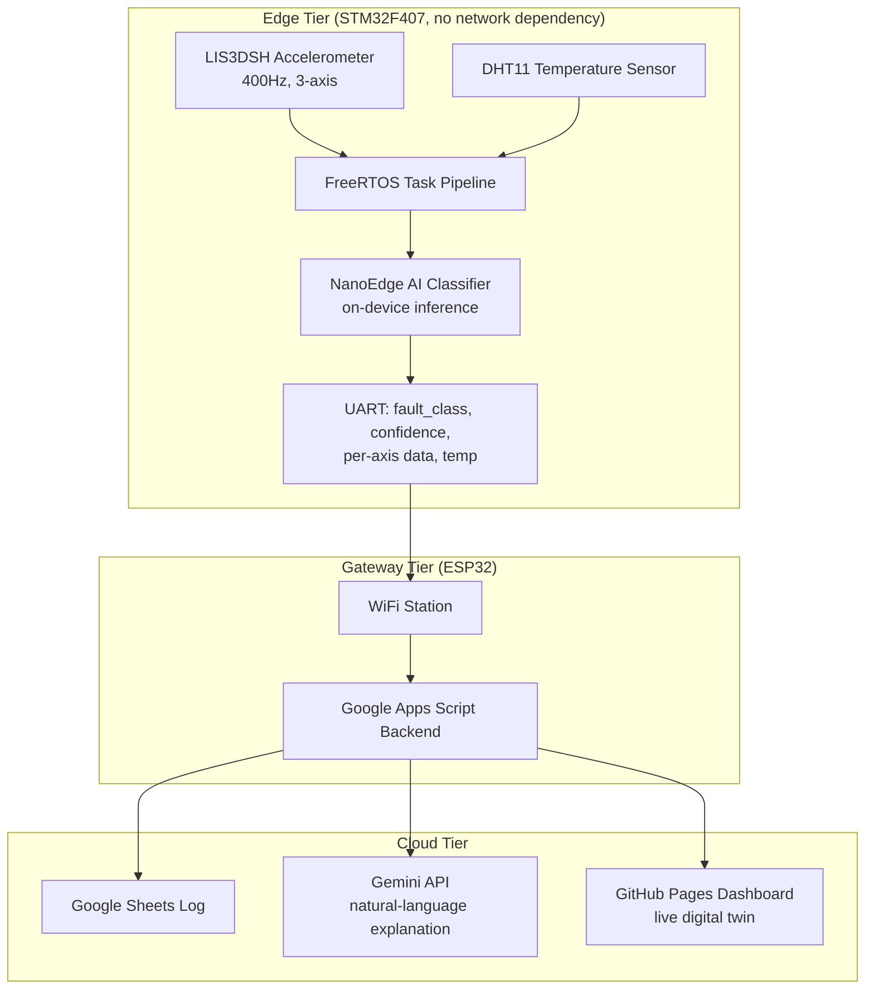
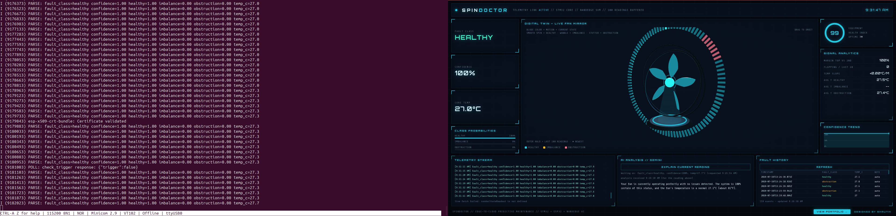
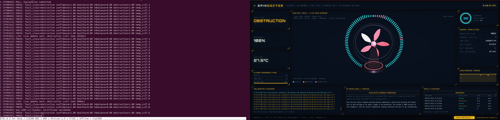
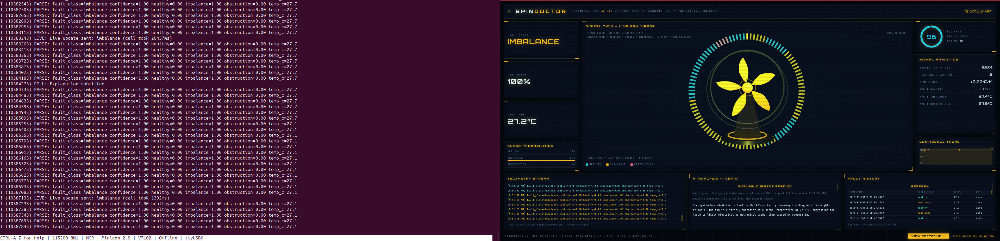
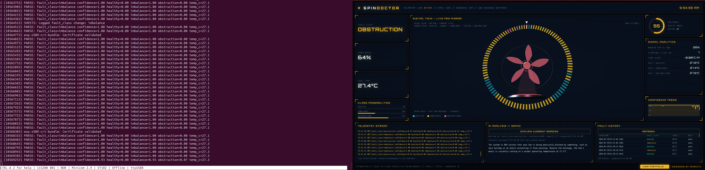
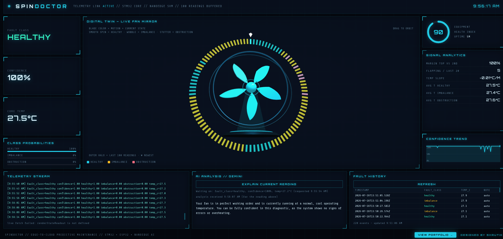

# SpinDoctor: Technical Writeup

This document is the full engineering log for SpinDoctor: every architecture decision, bug found, and fix made, from raw sensor data to a deployed on-device AI model to a live cloud-connected dashboard.

For a high-level, recruiter-facing overview, see **[README.md](README.md)**.

## Table of Contents

1. [Overview](#overview)
2. [Architecture](#architecture)
3. [Hardware](#hardware)
4. [Groundwork Before the Capstone](#groundwork-before-the-capstone)
5. [Firmware Architecture (STM32 Side)](#firmware-architecture-stm32-side)
6. [The FFT Detour](#the-fft-detour)
7. [Hardening Arc](#hardening-arc)
8. [Data Capture Pipeline](#data-capture-pipeline)
9. [Model Training (NanoEdge AI Studio)](#model-training-nanoedge-ai-studio)
10. [On-Device Inference Integration](#on-device-inference-integration)
11. [ESP32 Gateway](#esp32-gateway)
12. [Cloud Integration: Gemini + Apps Script + Sheets](#cloud-integration-gemini--apps-script--sheets)
13. [Dashboard](#dashboard)
14. [Proof of Work](#proof-of-work)
15. [Known Limitations and What's Left](#known-limitations-and-whats-left)
16. [Lessons Learned](#lessons-learned)
17. [Repository Structure](#repository-structure)
18. [How to Build / Run It](#how-to-build--run-it)
19. [Appendix](#appendix)

---

## Overview

SpinDoctor is a two-tier edge-to-cloud predictive maintenance system. A table fan stands in for real rotating industrial machinery (motors, pumps, compressors), and the system detects three operating states in real time using only vibration and temperature data:

- **Healthy** - normal operation
- **Blade imbalance** - an early-stage mechanical fault, often the first sign of wear before real damage occurs
- **Obstruction** - something physically blocking or dragging on the fan

The core design constraint driving every decision in this project: **fault detection must work entirely on-device**, with zero dependency on network connectivity. The cloud layer (Gemini explanation, Google Sheets logging, live dashboard) exists to make the result useful to a human, but it is not on the critical path for detecting the fault itself. This mirrors how real industrial predictive maintenance systems are designed, edge sensors and controllers cannot depend on a live internet connection to keep machinery safe.

### System diagram



### Why a fan

Access to real industrial rotating equipment for iterative fault-injection testing isn't realistic for a solo capstone project. A table fan provides the same fundamental physics, a rotating mass whose vibration signature changes predictably under imbalance or obstruction, in a form that's safe, cheap to experiment on, and fast to iterate with. The sensor pipeline, model architecture, and edge/cloud split built here transfer directly to a real industrial sensor node; only the physical mounting and fault-injection method would change.

## Architecture

### The two-tier split

SpinDoctor is deliberately split into two independent compute tiers rather than one chip doing everything:

| | STM32F407 (Edge) | ESP32 (Gateway) |
|---|---|---|
| **Responsibility** | Sensing, classification, safety | Connectivity, cloud calls, logging |
| **Depends on network?** | No | Yes |
| **Runs an OS?** | FreeRTOS (real-time) | FreeRTOS (via ESP-IDF, best-effort) |
| **Failure mode if it goes down** | Fault detection stops entirely | Only explanations/dashboard/logging pause |

This split exists because these two jobs have fundamentally different reliability requirements. Classification has to run predictably, every sample, every window, regardless of whether WiFi is up, a coffee shop's router just rebooted, or an API is rate-limited. Networking, by contrast, is inherently best-effort, retries, timeouts, and occasional failures are normal and acceptable. Putting both on one chip would mean a WiFi hiccup could stall or jitter the time-critical sensing loop. Splitting them means the STM32 never even knows the network exists.

### Data flow

1. **LIS3DSH** streams 3-axis acceleration via SPI+DMA at 400Hz, triggered by a data-ready interrupt
2. **DHT11** streams temperature on a slower, independent cycle
3. Both feed into a **FreeRTOS task pipeline** on the STM32 (full detail in [Section 5](#firmware-architecture-stm32-side))
4. Every 64-sample window, the on-device **NanoEdge AI classifier** produces a fault class and confidence score
5. The result, plus raw per-axis data and temperature, is packed into a JSON line and sent over **UART** to the ESP32
6. The ESP32 forwards this to a **Google Apps Script** backend, which logs it to **Google Sheets** and, on request, asks **Gemini** for a plain-language explanation
7. A **GitHub Pages dashboard** polls the Sheets backend and renders the live state, including a real-time animated "digital twin" of the fan

### Why UART between the two chips

A direct wired UART link (rather than, say, both chips on the same WiFi network talking over sockets) was chosen so the STM32's output is a single, simple, always-available interface regardless of the ESP32's network state. The STM32 doesn't need to know if the ESP32 is connected, booted, or even present, it just writes to UART. This decision is what makes the "STM32 doesn't know the network exists" property in the table above actually true, not just aspirational.

## Hardware

### Components

| Component | Role |
|---|---|
| **STM32F407G-DISC1** (STM32F407VGT6, Cortex-M4) | Edge compute: sensing, FreeRTOS, on-device AI inference |
| **LIS3DSH** (onboard the Discovery board) | 3-axis MEMS accelerometer, vibration sensing |
| **DHT11** | Digital temperature/humidity sensor |
| **ESP32-WROOM-32D** (30-pin, CP2102 breakout) | WiFi gateway, cloud integration |
| **Onboard ST-LINK** | Primary programmer/debugger for all SpinDoctor firmware work, including the stack overflow investigation ([Section 7](#hardening-arc)) |
| **SEGGER J-Link Pro** | Thread-aware debugging used during pre-capstone bring-up and mini-projects ([Section 4](#groundwork-before-the-capstone)) |
| **Comidox CP317 Logic Analyzer** | Protocol-level verification during bring-up |

### Physical setup and axis mapping

The STM32F407G-DISC1 board is mounted on the fan's rear motor housing via zip ties, behind the blade guard. The initial mount used a sponge as a gap-filler between the board and the curved housing surface. This sponge was removed during hardware iteration ([Section 9](#model-training-nanoedge-ai-studio)), alongside a firmware fix for a stack overflow bug, as part of resolving a speed 1 fault detection failure. The board is now direct-mounted against the housing with no compliant material in the vibration path, held only by the zip ties.

<p align="center">
  
</p>

The accelerometer's axis mapping was derived empirically rather than trusted from the datasheet's reference diagram, since the board ended up mounted at an orientation that didn't match the originally planned "short edge down," and tracing orientation visually off a datasheet diagram on a curved, zip-tied mount wasn't reliable. Instead, the whole fan assembly was tilted by hand in known directions while reading live X/Y/Z values over UART:

| Fan state | X | Y | Z |
|---|---|---|---|
| Rest (fan off) | ~13900 | ~3320 | ~955 |
| Tilted backward | drops modestly | swings hardest (+~6000) | flips sign |
| Tilted left | near baseline | near baseline | swings hard positive (+~7000) |
| Tilted right | near baseline | near baseline | swings hard negative (-~9000) |

This gave a working mapping: **X** behaves as a magnitude/residual axis (doesn't cleanly discriminate direction), **Y** tracks pitch (forward/backward), **Z** tracks lean (left/right) and gives the cleanest, strongest signal of the three.

### Fault induction

Fault states were physically induced on the same fan rather than simulated in software:
- **Blade imbalance**: a small weight added asymmetrically to one blade, shifting the rotational mass distribution
- **Obstruction**: a physical object introduced to partially block or drag on the blade path during rotation

Both fault types were tested across all 3 fan speed settings, since vibration signature strength scales with RPM, this is what surfaced the low-speed classification issue discussed in [Section 9](#model-training-nanoedge-ai-studio).

### A sensor that was descoped: RPM via Hall sensor

An earlier design included direct RPM sensing via Timer Input Capture, reading pulses from a Hall sensor and a magnet mounted on a fan blade. The capture logic itself worked correctly in isolation, but the physical mounting proved fundamentally impractical: any magnet large enough for reliable detection introduced a real, physically significant rotor imbalance at the blade radius. Moving the magnet closer to the hub to reduce that imbalance made detection worse, since the smaller radius meant less surface area and a weaker signal. At higher fan speeds, the resulting imbalance was severe enough to make the entire fan assembly walk across the surface it was sitting on.

RPM sensing was deliberately descoped rather than pursued further: the accelerometer alone already provides a complete fault signal for all three target classes via vibration, and RPM was only ever intended as a secondary correlating signal, not a load-bearing one for classification. A working RPM implementation is preserved on a separate branch outside the main integrated firmware, in case it's worth revisiting later.

### Wiring

- **LIS3DSH**: onboard, connected internally via SPI1 (no external wiring required)
- **DHT11**: single-wire bit-banged data line on **PB6**, timing handled via the ARM DWT cycle counter for microsecond-accurate pulse measurement. (This pin was originally intended for a different, dedicated motor-adjacent temperature sensor; that part turned out to not actually be in inventory, confirmed via a UART-only diagnostic that sampled the data line after a reset pulse and printed the raw response, which came back flat. Pivoted to the DHT11, already on hand with a proven driver from earlier bring-up work.)
- **STM32 → ESP32 link**: USART3, **PB10 (TX)** → ESP32 **GPIO16 (RX)**, and **PB11 (RX)** ← ESP32 **GPIO17 (TX)**
  - USART3 was chosen specifically over USART1 to avoid a pin conflict with the Discovery board's onboard audio codec, which shares pins with USART1 in this board's default configuration

## Groundwork Before the Capstone

SpinDoctor wasn't the starting point, it was built after a deliberate skill-building phase, kept in a separate practice repository so the capstone repo stays focused and standalone.

### STM32 and RTOS fundamentals

A series of STM32 practice projects were completed first, covering peripheral-level fundamentals (GPIO, timers, SPI, I2C, UART, ADC/DMA) primarily using the STM32 HAL, followed by a full FreeRTOS curriculum covering task design, synchronization primitives, and **thread-aware debugging using a SEGGER J-Link Pro**, pausing execution and inspecting live task state and call stacks rather than relying on print statements alone. This debugging skill was applied directly during the capstone's own stack overflow investigation ([Section 7](#hardening-arc)), just using the onboard ST-LINK at that stage instead.

### Structured bring-up sequence

Before SpinDoctor integration began, a structured sequence of mini-projects was completed to validate each subsystem in isolation before combining them, sensor bring-up, peripheral drivers, and FreeRTOS subsystem validation, each proven working independently before being integrated into the more complex multi-task system.

This sequencing matters for one reason: every peripheral driver used in SpinDoctor (SPI+DMA, bit-banged timing, interrupt-driven UART) was already validated independently, in isolation, before being integrated into the more complex multi-task FreeRTOS system. When something broke during capstone integration, it was reasonable to assume the bug was in the integration, not in a peripheral driver seeing real hardware for the first time.

## Firmware Architecture (STM32 Side)

### Why FreeRTOS

Five things need to happen concurrently on one chip: sample vibration at 400Hz without ever missing a sample, read temperature on a slow independent cycle, feed a live capture menu over UART, run on-device inference on completed windows, and guarantee the system recovers if anything hangs. A bare superloop makes it very easy for a slow operation (a print, a sensor read with a timeout) to delay something time-critical. FreeRTOS lets each concern run as its own task with its own priority, so the scheduler, not hand-written timing logic, guarantees the accelerometer path is never starved.

### One-time boot sequence

Before the FreeRTOS scheduler starts, `main()` runs sequentially:

1. **HAL_Init()** and **SystemClock_Config()** - core init, PLL configured to 168MHz
2. **Peripheral init** - GPIO, DMA, SPI1, USART2/USART3, ADC1, IWDG
3. **LIS3DSH init** - ODR set to 400Hz, axis enable, then a second explicit register write routes DRDY to INT1/PE0; without this second step the chip never pulses PE0 and the EXTI interrupt never fires at all
4. **DWT cycle counter enabled** - required for microsecond-accurate delays used by the DHT11 bit-banged protocol; forgetting this silently hangs that task forever with no crash, just a task that never returns from a wait loop
5. **ADC1 started in circular DMA mode** - from this point, temperature-sensor raw readings update automatically in hardware with no further software trigger
6. **Interrupt-driven UART receive armed** - `HAL_UART_Receive_IT` is started for the capture menu before the scheduler even starts, since blocking-mode receive doesn't coexist safely with DMA-based transmit already active on the same UART
7. **NanoEdge AI classifier init** - loads the trained model; if this fails, the system halts in `Error_Handler()` rather than running with an uninitialized classifier
8. **FreeRTOS objects created** - all mutexes, semaphores, and tasks are created here, but nothing runs yet
9. **Both capture semaphores drained** - a CMSIS-RTOS V1 quirk creates semaphores with an initial token already set; `captureDataReadyHandle` and `captureRxByteReadyHandle` are both drained immediately so their respective tasks correctly block on their *first* wait instead of running once against garbage data
10. **Thread creation checked** - each `osThreadCreate()` return value is checked for `NULL`; a failure reports directly over blocking UART, bypassing the mutex/DMA-based print path entirely, since if RTOS object creation itself is failing, the mutex and DMA infrastructure it depends on can't be trusted either
11. **osKernelStart()** - hands control to FreeRTOS; `main()` never returns from here

### Task architecture

| Task | Priority | Stack (words) | Responsibility |
|---|---|---|---|
| **AccelTask** | Normal (highest) | 512 | Polls a data-ready flag set by the SPI/DMA interrupt chain, fills ping-pong capture buffers, signals when a full window is ready |
| **CaptureTask** | Below Normal | 512 | Runs the interactive UART menu used to select fan speed/fault class and record training data |
| **InferenceTask** | Below Normal | 1024 | Runs the on-device classifier on each completed sample window and reports the result |
| **DHT11Task** | Low | 256 | Bit-banged temperature read every 3s; purely informational |
| **WatchdogTask** | Low | 512 | Refreshes the IWDG watchdog every 500ms |

Most of this ordering follows a clear rule: priority is assigned by how time-sensitive the data is. Missing an accelerometer sample corrupts a window and potentially the classification, so AccelTask runs highest. Temperature is slow-moving, informational context, so DHT11Task runs lowest.

**One inconsistency worth naming honestly:** the watchdog pattern from earlier practice work was explicitly designed with the watchdog task running at a *higher* priority than the tasks it's meant to catch, the reasoning being that a runaway task at equal or higher priority could starve the watchdog out entirely, defeating its purpose. In SpinDoctor, `WatchdogTask` ended up at `osPriorityLow`, tied with `DHT11Task`, contradicting that earlier principle. This wasn't a deliberate re-decision, it's a byproduct of assigning the other four tasks their priorities first and the watchdog landing wherever was left. It currently works because no task in this system has actually starved the scheduler long enough to expose the gap, but it's a known latent risk, and the honest fix would be raising `WatchdogTask` above every worker task it's meant to protect against.

### How a sample actually moves through the system

The LIS3DSH pulses its DRDY pin on an external interrupt line every ~2.5ms (400Hz). That interrupt starts a burst SPI read over DMA: a 1-byte address transmit, whose completion callback starts a 6-byte data receive, whose completion callback reconstructs X/Y/Z and sets a `LIS3_DataReady` flag. None of this blocks any task. AccelTask itself runs a loop polling that flag with `osDelay(1)` between checks, so the expensive part (the actual SPI transaction) happens entirely in interrupt/DMA context, and the task only does lightweight bookkeeping: writing the sample into the current ping-pong buffer (`capture_buf_x/y/z[2][64]`), and once every 64 samples, releasing `captureDataReadyHandle` to signal a complete window downstream. This buffer fill and semaphore release happen unconditionally on every sample, whether or not a training capture is active, since both CaptureTask (during capture) and InferenceTask (during normal operation) need a continuous, uninterrupted stream of windows. A separate `capture_active` flag only gates whether AccelTask also prints a throttled diagnostic line, it does not gate whether data flows into the shared buffer.

### Mutexes

- **`diagnosticsMutexHandle`** - protects a shared diagnostics struct. AccelTask and DHT11Task write to it (accelerometer values, temperature/humidity); InferenceTask reads the temperature back out of it when building the JSON payload sent to the ESP32. Held only for the duration of the actual struct access, never across a slow call like a print.
- **`printfMutexHandle`** - protects the underlying print call and the C library's internal formatting state, which is not safe to call from two tasks at once; without this, two tasks printing near-simultaneously produced visibly corrupted, interleaved output during development. Deliberately **not** used inside `vApplicationStackOverflowHook`, that handler uses direct blocking `HAL_UART_Transmit` instead, because the offending task's stack may already be corrupted, and taking a mutex plus routing through printf's formatting would push more onto that same compromised stack before the message can get out.

### Semaphores

- **`uartTxSemaphoreHandle`** - serializes UART DMA transmissions so only one transfer is ever in flight; released by the transfer-complete interrupt callback. `_write()` (the function `printf` ultimately calls) waits on it, starts the DMA transfer, then waits on it again with a **bounded 200ms timeout**, not `osWaitForever`, so a stuck transfer surfaces as a single dropped line instead of freezing every future `printf` call in the system. This semaphore is strictly paired with DMA-mode transmission only; a blocking-mode transmit call must never touch it, since blocking mode never fires the completion callback that releases it, which would permanently consume a token that's never returned.
- **`captureDataReadyHandle`** - signals that a full sample window is ready in the ping-pong buffer; both CaptureTask and InferenceTask wait on it, with the `capture_active` flag determining which one is the intended consumer at any given moment (InferenceTask skips and loops again if a capture session owns the data).
- **`captureRxByteReadyHandle`** - signals that a byte has arrived over UART, used by CaptureTask to block on user input during the training-data capture menu without busy-waiting.

### A design principle worth naming

Task stack sizes and FreeRTOS configuration are treated as living tuning parameters, not fixed at design time. Every task's stack size in this project was revised at least once after real evidence (a stack overflow, see [Section 7](#hardening-arc)) rather than guessed upfront and left alone. CubeMX's `.ioc` file is kept as the single source of truth for these values, rather than hand-editing generated config headers directly.

## The FFT Detour

Before committing to NanoEdge AI for classification, a CMSIS-DSP FFT pipeline was built on top of the ping-pong accelerometer buffers, to validate that the sensor was actually picking up genuine mechanical signal before investing further in a classification approach. It worked: the FFT confirmed a real, independently-verifiable peak at the fan's actual blade-pass frequency, matching separately-measured RPM.

The FFT branch introduced an intermittent reset bug. Rather than chase it by guessing at fixes within the FFT code, the bug was isolated through a full session of systematic elimination, and once isolated, the decision was made to abandon the FFT branch entirely: NanoEdge AI performs its own frequency-domain feature extraction internally, so the FFT's output was never actually needed downstream, meaning the branch carrying the bug wasn't worth continuing to debug. `main` was reset back to a pre-FFT commit via `git bisect` rather than trying to cherry-pick around the regression.

This is documented here as an engineering decision, not a failure: the FFT pipeline served its actual purpose, proving the sensing pipeline was sound, and was retired once it stopped adding value rather than kept out of sunk-cost attachment.

## Hardening Arc

Before real fan data was ever captured, the firmware went through a deliberate hardening pass, five fixes, all found through actual system failures during development, not added speculatively.

### The stack overflow investigation

**Symptom:** the system was resetting periodically via the IWDG watchdog, with no crash, no fault handler triggering, no visible cause in the UART output. Several software-level hypotheses were tried and ruled out first.

**Root cause, found properly:** rather than continuing to guess, the onboard ST-LINK was used to pause the CPU mid-freeze and inspect the live FreeRTOS call stack directly. This revealed the actual cause: silent stack overflows, corrupting adjacent memory without ever triggering an obvious fault, in three separate tasks in sequence as each was investigated and fixed. Task stacks were increased from their original values to what's shown in [Section 5](#firmware-architecture-stm32-side)'s task table.

**The explicit lesson from this arc:** a stack overflow is a risk class, not a one-off. The first overflow that surfaced was treated as an isolated incident, then the same symptom recurred in a second and third task. The real fix was to review every task's stack sizing systematically, not just patch the one that happened to fail first.

### Stack overflow detection (Method 2)

`configCHECK_FOR_STACK_OVERFLOW` is set to `2` in `FreeRTOSConfig.h`, FreeRTOS's more thorough overflow-checking mode, which fills each task's stack with a known pattern at creation and checks it hasn't been corrupted on every context switch. When it fires, `vApplicationStackOverflowHook()` reports the offending task's name over UART using a **direct blocking `HAL_UART_Transmit` call**, deliberately bypassing both `printfMutexHandle` and the DMA-based `_write()` path. The reasoning: the offending task's stack may already be corrupted at this point, and taking a mutex or routing through printf's internal formatting would push more data onto that same compromised stack before the diagnostic message can even get out.

### DWT cycle counter re-enable

The DWT cycle counter, which `delay_us()` and the DHT11 bit-banged timing protocol depend on entirely, was found disabled during a cleanup pass. Without it, `DHT11Task` doesn't crash or fault, it silently hangs forever in a wait loop with no visible symptom at all. Re-enabling it (`DEM_CR`, `DWT_CYCCNT`, `DWT_CTRL` register writes in `main()` before the scheduler starts) resolved this.

### printf mutex (newlib reentrancy)

`configUSE_NEWLIB_REENTRANT` is set to `1` in `FreeRTOSConfig.h`, but that alone doesn't make `printf` itself safe to call from multiple tasks, it only gives each task its own reentrant C library context. The underlying UART transmit path still needed explicit protection: `printfMutexHandle` was added around every print call in the codebase, after two tasks printing near-simultaneously produced visibly corrupted, interleaved output during development (partial lines from two different tasks fusing together mid-word).

### Reset-cause diagnostics

`WatchdogTask` checks the RCC reset-cause flags once at boot (`RCC_FLAG_IWDGRST`, `RCC_FLAG_LPWRRST`, `RCC_FLAG_PORRST`, `RCC_FLAG_PINRST`) and prints which one caused the last reset, then clears the flags. This is what made the stack overflow investigation possible in the first place, without it, every reset looked identical from the outside, with it, an IWDG reset was immediately distinguishable from a normal power-on or manual reset, narrowing the search from the very first symptom.

### Hard fault handler with register dump

A full Cortex-M hard fault handler was added, going beyond the default "loop forever" stub CubeMX generates. On any hard fault, a short assembly stub determines which stack pointer (MSP or PSP) was active at the moment of the fault, then hands that address to `prvGetRegistersFromStack()`, a C function that extracts the CPU registers the hardware automatically pushed at fault time (R0-R3, R12, LR, PC, PSR) directly off the stack, along with the Configurable Fault Status Register (CFSR), and prints all of it over UART before halting. In particular, the **PC value is the exact instruction address that faulted**, which turns a hard fault from "the system silently died" into "here is exactly where and why," directly loadable into a disassembly listing to find the faulting line.

### UART DMA + polling conflict

Separately from the stack overflow arc, an early version of the capture menu used blocking-mode `HAL_UART_Receive`, which does not coexist safely with DMA-based transmit already active on the same UART peripheral, it would return immediately in a busy/error state instead of genuinely blocking for input. This was replaced with interrupt-driven receive (`HAL_UART_Receive_IT`, re-armed on every byte via `HAL_UART_RxCpltCallback`), which has no such conflict.

## Data Capture Pipeline

### Capture protocol

A menu-driven UART capture system runs on `CaptureTask`: send two characters to select a target (speed `1`-`3`, class `H`/`I`/`O`), send `S` to begin, and the firmware streams a fixed number of complete 64-sample windows as CSV rows, one row per window, 192 comma-separated integers per row (64 samples × 3 axes).

### The UART DMA race condition

Once real capture volume started flowing, a serious timing bug appeared: transmitting a row over UART DMA takes real wall-clock time, and the 400Hz accelerometer fill rate can produce the *next* complete window before the *current* row has finished transmitting, if both share the same buffer, the row gets corrupted mid-transmission.

Root-caused and fixed with a **4-way row-buffer ping-pong**, a buffer actively being transmitted is never the same one being written into next, plus a bump to **460800 baud** to shrink the wire-time bottleneck that was making the race easy to hit in the first place.

### Training matrix and cleaning

All 9 speed/class combinations (3 speeds × 3 classes) were captured, initially at 156 windows per file, later increased to **350 windows per file** for richer per-class training data once the pipeline was stable enough to sustain a longer uninterrupted capture.

Each raw `.log` file is cleaned by `tools/clean_captures.py` before NanoEdge import, run per data directory:

```bash
python3 clean_captures.py /home/shrutik/SpinDoctor/data
```

The cleaning logic works in two passes over each line:
1. **Known non-data lines are filtered out first and not counted at all** - menu text, prompts, and diagnostic prints (lines starting with `===`, `X:`, `DHT11`, `RESET`, `!!!`, `Speed`, `Class`, `Enter`, `Send`, `Selected`, `Invalid`, `Cancelled`) are skipped outright, since they were never meant to be data rows in the first place.
2. **Every remaining line is treated as a candidate data row** and validated against a strict regex (`^-?\d+(,-?\d+)*$`) requiring it to be *only* comma-separated integers, with exactly `192` fields (64 samples × 3 axes). Any row that doesn't match exactly, fused rows, truncated rows, anything malformed, is dropped rather than repaired.

The script prints a per-file summary (`candidate_rows`, `kept`, `dropped`) and writes only well-formed rows to a matching `*_clean.csv`. Every cleaned file was independently verified before NanoEdge import (`wc -l` for exact row count, `awk -F',' '{print NF}' | sort -u` to confirm every row has exactly 192 fields), landing at exactly 350 rows with zero dropped rows across all 9 files.

### A capture bug that was actually a symptom of something bigger

A printf/menu corruption bug traced during this phase turned out to be the entry point into a much larger issue: `_write()` was starting a UART DMA transfer and returning immediately, without confirming the hardware had actually finished, before printf's internal buffer was safe to reuse. Fixing that correctly (blocking on the transfer-complete semaphore) had a second-order effect: every `printf` call now legitimately held its calling task's stack frame open for the real transfer time (~13ms at 115200 baud) instead of returning instantly, which is what actually exposed the three-task stack overflow chain described in [Section 7](#hardening-arc). The capture pipeline's own corruption bug and the project's most serious hardening arc share the same root cause.
## Model Training (NanoEdge AI Studio)

### First pass: SVM, trained on unreliable capture data

The first full capture round (all 9 speed/class combinations, [Section 8](#data-capture-pipeline)) was unstable at the data level before any model was trained. Window counts per file were inconsistent, ranging roughly **50 to 150** rows instead of a fixed expected count, and captures had to be repeated multiple times per combination to land on the best available file.

A benchmark was run on this data anyway. NanoEdge AI Studio selected an SVM model:

| Metric | Value |
|---|---|
| Quality index | 99pt |
| Balanced accuracy (benchmark) | 100% |
| RAM footprint | ~1.9 KB |
| Flash footprint | ~2.3 KB |
| Inference time | ~0.3 ms |

<!-- SCREENSHOT PLACEHOLDER: NanoEdge Studio benchmark result screen for the SVM model -->

This SVM was flashed onto the STM32 and tested live. Speed 2 and 3 fault detection was correct across classes, but **speed 1 fault detection consistently failed**.

### Root cause: the stack overflow, not the model

The inconsistent, wildly varying row counts during capture were the real signal, a fixed-size capture protocol producing a randomly varying row count per run points at a data integrity problem, not a modeling one. This is what prompted the ST-LINK debugging session in [Section 7](#hardening-arc), which found silent stack overflows corrupting memory across three separate tasks.

Two changes were made before the next capture round, not one:
1. The three stack overflows were fixed
2. **The sponge previously used as a gap-filler under the STM32 board mount was removed entirely** ([Section 3](#hardware)), the board now sits directly against the motor housing, held only by the zip ties

Because both changes happened together, it isn't possible to cleanly isolate which one actually resolved the speed 1 problem, the corrupted capture data alone is a fully sufficient explanation on its own, but the sponge's removal could plausibly have also improved vibration coupling at the specific low-amplitude signal levels speed 1 produces. Both are documented here rather than picking one as the sole cause without evidence.

### Second pass: clean recapture, CNN selected

All 9 combinations were recaptured from scratch under the new conditions, at 350 windows per file, verified clean via `wc -l` and field-count checks with zero dropped rows across every file ([Section 8](#data-capture-pipeline)).

This clean dataset was benchmarked once. This time NanoEdge AI Studio selected a different architecture, a CNN:

| Metric | Value |
|---|---|
| Model | CNN (library #57) |
| Quality index | 99pt |
| Balanced accuracy (benchmark) | 100% |
| RAM footprint | ~1.8 KB |
| Flash footprint | ~2.9 KB |

<!-- SCREENSHOT PLACEHOLDER: NanoEdge Studio benchmark result screen for the CNN model, showing library #57 -->

### Deployment bug: class name mapping

The generated `NanoEdgeAI.h` diffed identically against the previous SVM build except for the model ID (`NEAI_ID`), a clean drop-in replacement at the header level. However, this CNN build's `neai_get_class_name()` returned raw index characters instead of proper class name strings, a library-level quirk rather than an integration mistake. Fixed with a hardcoded `class_names[]` array in firmware (`{"obstruction", "imbalance", "healthy"}`), ordered to match the class indices verified against the model's own metadata.

### Current validated state

With the clean recapture, the direct-mounted sensor, and the CNN deployed, fault detection across all three speeds became correct, resolving the speed 1 failure seen with the first SVM. Full class-by-class, speed-by-speed validation is covered in the proof-of-work capture in [Section 14](#proof-of-work).
## On-Device Inference Integration

### Where InferenceTask sits

`InferenceTask` runs at `osPriorityBelowNormal` with a 1024-word stack, the largest stack of any task in the system, reflecting that SVM/CNN inference math needs meaningfully more working memory than the lightweight bookkeeping done by `AccelTask` or `DHT11Task`. It waits on the same `captureDataReadyHandle` semaphore as `CaptureTask` ([Section 5](#firmware-architecture-stm32-side)), so both tasks are, structurally, competing consumers of the same signal. The `capture_active` flag determines which one is the intended consumer at any given moment: if a training capture session owns the data, `InferenceTask` skips that window and loops back to wait for the next one, rather than running inference on data meant for capture.

When it is the intended consumer, `InferenceTask`:
1. Reads the completed 64-sample, 3-axis window out of the ping-pong buffer
2. Runs `neai_classification()` on it
3. Looks up the winning class using the hardcoded `class_names[]` array ([Section 9](#model-training-nanoedge-ai-studio))
4. Reads the current temperature from the diagnostics struct under `diagnosticsMutexHandle`
5. Builds a flat JSON line (`fault_class`, per-class confidence, `temp_c`) and transmits it over USART3 to the ESP32

### The semaphore bug: inference only ran during training

An early version of `InferenceTask` had a bug where the semaphore release feeding it was scoped to only fire during active training captures, meaning the model would run against windows while `CaptureTask` was recording data, but never during genuine standalone operation with no capture session active. This is the same class of `capture_active`-gating issue described in [Section 5](#firmware-architecture-stm32-side): the fix was making the buffer fill and semaphore release unconditional on every sample, so both `CaptureTask` and `InferenceTask` reliably get a continuous stream of windows regardless of which one is the active consumer. Without this fix, the system would have appeared to work correctly during development (because captures were happening) while being non-functional as an actual standalone fault detector.

### configENABLE_FPU

`configENABLE_FPU` in `FreeRTOSConfig.h` was found set to `0`, disabling the Cortex-M4's hardware floating-point unit at the RTOS level even though the underlying silicon supports it. This matters directly for `InferenceTask`: NanoEdge AI's SVM and CNN models both do real floating-point arithmetic per classification, and without `configENABLE_FPU` set to `1`, that math either falls back to slow software floating-point emulation or risks FPU state not being properly saved/restored across context switches, either of which is a real correctness and performance risk for a task expected to run once per completed window. Corrected to `1`.

### Why inference speed matters relative to the sampling rate

The LIS3DSH samples at 400Hz, one sample every 2.5ms, and a full 64-sample window completes roughly every 160ms. The first deployed SVM model's benchmark reported an inference time of ~0.3ms per classification, over two orders of magnitude faster than the time budget available between windows. This headroom is what makes it safe for `InferenceTask` to sit at a lower priority than `AccelTask`, there's no risk of inference itself becoming the bottleneck that causes a missed sample.

The CNN model that replaced the SVM ([Section 9](#model-training-nanoedge-ai-studio)) was not independently benchmarked for its own inference time in the same way, this is a gap worth closing when the NanoEdge Studio screenshots are added, but given the CNN's flash footprint (~2.9KB) is still small and comparable to the SVM's, it's reasonable to expect inference time is in the same low-millisecond range rather than a meaningful fraction of the 160ms window budget. Documented here as an assumption, not a verified number.
## ESP32 Gateway

### Project scaffold and partition table

The ESP32 side is a standalone ESP-IDF project (`spindoctor_gateway`). Rather than using the default partition layout, a custom `partitions.csv` reserves a dedicated `creds` NVS partition, separate from the WiFi driver's own internal `nvs` partition:

| Name | Type | SubType | Offset | Size |
|---|---|---|---|---|
| nvs | data | nvs | 0x9000 | 0x6000 |
| phy_init | data | phy | 0xf000 | 0x1000 |
| factory | app | factory | 0x10000 | 1M |
| creds | data | nvs | *(auto)* | 0x3000 |

The `creds` partition's offset is left blank in the table, so `esptool` places it automatically directly after the factory app partition ends, landing at `0x110000`. Keeping WiFi credentials and the Gemini API key in their own dedicated partition, rather than mixed into the same `nvs` partition the WiFi driver manages internally, means credentials can be erased, reflashed, or backed up independently of the driver's own state, and there's no risk of an NVS operation on one accidentally colliding with the other.

### Credential handling

At boot, `app_main()` initializes both NVS partitions (`creds` and the default `nvs`), then opens `creds` **read-only** (`NVS_READONLY`) under the namespace `wifi_creds` and reads three values: `wifi_ssid`, `wifi_pass`, and `gemini_api_key`. Any read failure logs the specific key that failed and returns early rather than proceeding with partial credentials. None of these values are ever logged directly, only lengths (`Password length: %d chars`, `Gemini key length: %d chars`), so a log capture can't leak a credential by accident. The `creds` partition's source data never enters the public repo, it's flashed independently via `nvs_partition_gen.py` and kept out of version control entirely.

### WiFi station bring-up

WiFi connection uses a FreeRTOS event group (`WIFI_CONNECTED_BIT`, `WIFI_FAIL_BIT`) and a shared event handler covering both `WIFI_EVENT` and `IP_EVENT`. On `WIFI_EVENT_STA_DISCONNECTED`, the handler retries up to `MAX_RETRY` (5) times before giving up and setting `WIFI_FAIL_BIT`; a successful `IP_EVENT_STA_GOT_IP` resets the retry counter to zero and sets `WIFI_CONNECTED_BIT`. `wifi_init_sta()` blocks on `xEventGroupWaitBits()` with `portMAX_DELAY` until one of the two bits is set, so `app_main()` doesn't proceed to task creation until WiFi is either definitively up or definitively failed.

### STM32 to ESP32 UART link

The ESP32 receives on `UART_NUM_2`, RX on GPIO16, TX on GPIO17, at 115200 baud, matching the STM32's blocking `HAL_UART_Transmit` on USART3 described in [Section 3](#hardware). `stm32_uart_task` reads one byte at a time with a 1-second timeout, accumulating into a line buffer until it sees `\n`, then hands the complete line to `parse_stm32_line()`. This byte-by-byte approach replaced an earlier chunk-read version that fragmented JSON lines mid-message when a read didn't happen to land on a line boundary.

`parse_stm32_line()` parses the line as JSON and validates every field's presence and type (`fault_class` must be a string, `confidence`/`healthy`/`imbalance`/`obstruction`/`temp_c` must all be numbers) before accepting the reading, if any field is missing or the wrong type, the whole line is rejected and logged rather than partially accepted.

### Decoupling UART reading from the network

A valid reading updates `s_latest_reading` under `s_reading_mutex`, a shared struct read by both `live_update_task` (periodic dashboard push) and `gateway_poll_task` (Gemini trigger handling). Separately, if the fault class has changed since the last logged value, a lightweight `log_request_t` (just `fault_class` and `temp_c`) is pushed onto `s_log_queue` with a **non-blocking** `xQueueSend(..., 0)`, if the queue is momentarily full, the event is dropped and logged as a warning rather than ever blocking.

This queue exists specifically to keep the slow, occasionally-flaky HTTPS POST call off `stm32_uart_task` entirely. An earlier version made the HTTPS call directly from the UART-reading task; when that call blocked or was slow, the STM32's internal UART ring buffer would overflow in the meantime and corrupt subsequent lines, since the STM32 keeps transmitting on its own schedule with no flow control back to the ESP32. `sheets_log_task` drains this queue independently, so a slow network call now only delays a Sheets log entry, never the UART read loop itself.

### Persistent HTTP clients and the DNS race

All calls to the Apps Script backend (`script.google.com`) go through one of two **persistent, reused** `esp_http_client` handles, one for POST, one for GET, created once on first use and kept alive rather than a fresh `init`/`cleanup` pair per call. A from-scratch TCP+TLS handshake was measured taking 1-4+ seconds on this chip; once `live_update_task` started firing every few seconds on top of the other tasks, that handshake cost alone was consuming most of the interval (a 3-second target interval measured at 7-15 seconds actual).

Both clients are only ever used under a single `s_apps_script_mutex`, serializing every call to `script.google.com` across tasks. This isn't just about avoiding response buffer collisions, lwIP's DNS resolver has a limited number of concurrent outstanding lookups per hostname, and two tasks racing a lookup for the same hostname at once was causing intermittent `getaddrinfo()` failures. Serializing avoids that race entirely.

If a call fails (`err != ESP_OK`), both `apps_script_post()` and `apps_script_get()` reset the corresponding client (cleanup and recreate) and retry exactly once before giving up, a single transient failure doesn't need a full client teardown on every occurrence, but a client stuck in a bad state shouldn't be reused indefinitely either.

### POST vs GET redirect handling

Apps Script's web app always responds to requests with a redirect. POST actions (`log_reading`, `submit_explanation`) never follow it, Apps Script executes the POST's side effect (writing to the sheet) *before* issuing the redirect, so a 302 response already confirms success, and the response body is never needed for these actions.

GET actions (`check_trigger`, `get_explanation`, live data fetches) do need the response body, since the redirect target (a `script.googleusercontent.com` echo endpoint) is where the actual JSON lives. The redirect here is followed **manually**: `esp_http_client_set_redirection()` is called explicitly, with the response buffer cleared before the follow-up request. Automatic redirect handling was tried first and reverted, `esp_http_client`'s automatic mode still fires the body event handler for the intermediate 302 page's HTML before internally following the redirect, and there's no hook to clear the shared buffer in between. That meant the 302 page's HTML and the final JSON response ended up concatenated in the same buffer on every call, which is why `check_trigger`'s response consistently failed to parse as JSON even though the HTTP call itself reported success. This was the actual root cause of the Gemini explanation flow never completing.

### Task architecture

| Task | Priority | Responsibility |
|---|---|---|
| `stm32_uart_task` | 5 | Reads UART byte-by-byte, parses JSON lines, updates shared reading, queues change-based log events |
| `gateway_poll_task` | 5 | Polls `check_trigger` every 5s, calls Gemini and submits the explanation when triggered |
| `sheets_log_task` | 4 | Drains the log queue, performs the actual HTTPS POST to log a fault class change |
| `live_update_task` | 3 | Pushes the latest reading to the dashboard's live data source every 2.5s, independent of change-based logging |

`live_update_task` runs on a fixed timer rather than firing on every new STM32 reading, since the dashboard only needs to feel live at human-perceptible speed, not at the full inference rate.
## Cloud Integration: Gemini + Apps Script + Sheets

### The Gemini prompt: designed rich, shipped simple

Before any ESP32 firmware existed, a richer prompt design was worked out and validated conceptually in Google AI Studio: a system-instructions field describing six input fields (fault class, per-class confidence, per-axis vibration frequency/magnitude, RPM, temperature, and a short history of recent readings), with explicit rules requiring the model to ground its explanation in specific numbers, flag ambiguous confidence scores, describe trends rather than just a snapshot, and never invent data. A thin payload and a rich payload were hand-pasted side by side to confirm the richer version actually produced a meaningfully different, more grounded explanation before committing to build it into firmware.

That design was never carried into the deployed integration. The actual `call_gemini()` in `spindoctor_gateway.c` sends a single-sentence prompt built from just three fields:

```c
"Explain this fan diagnostic reading in plain English, 2-3 sentences: "
"fault class %s, confidence %.2f, temperature %.1fC."
```

No system instructions field, no per-axis vibration data, no RPM, no history. This is a real, honest gap between what was designed and what shipped, not a case of the simpler version being a deliberate later simplification. It's flagged here as a concrete, scoped item for [Section 15](#known-limitations-and-whats-left) rather than glossed over: the plumbing to support the richer payload already exists everywhere else in the system (the STM32 already computes and could transmit richer per-axis data, the Apps Script `Live` tab already stores it), the missing piece is solely in how `call_gemini()` builds its request body.

### Apps Script backend

`backend/apps-script/Code.gs` is a single web app multiplexing on an `action` field in both `doGet` and `doPost`:

| Action | Method | Purpose |
|---|---|---|
| `log_reading` | POST | Appends a row to `Sheet1` (timestamp, fault class, temp, note), the append-only historical log |
| `update_live` | POST | Appends a row to the `Live` tab (timestamp, fault class, confidence, per-class scores, temp), trimmed to the most recent 100 rows |
| `request_explanation` | POST | Sets `Control!A2` to `true`, the trigger flag `gateway_poll_task` watches for |
| `submit_explanation` | POST | Writes the Gemini explanation to `Control!B2` and clears the trigger flag |
| `check_trigger` | GET | Returns whether `Control!A2` is currently `true` |
| `get_explanation` | GET | Returns the current value of `Control!B2` |
| `get_live` | GET | Returns the full `Live` tab as row data, for the dashboard |
| *(none)* | GET | Default: returns `Sheet1`'s full row data |

`Control!A2`/`B2` act as a single-slot mailbox: one boolean trigger, one text explanation, rather than a queue. This is intentional given the system's usage pattern (a technician requesting one explanation at a time), not a general-purpose message queue.

### Live ring buffer

The `Live` tab is capped at 100 rows by deleting row 2 (the oldest data row, row 1 being the header) whenever a new `update_live` append pushes the sheet past 101 total rows. This keeps the dashboard's live data source bounded regardless of how long the system runs, rather than growing `Live` indefinitely the way `Sheet1`'s historical log does.

### Zero-value handling

`orBlank()` exists because Apps Script's `appendRow()` and JavaScript's own falsy-value handling would otherwise write an empty cell for a legitimate `0` confidence or temperature reading, indistinguishable from a genuinely missing field. `orBlank()` only substitutes an empty string for `undefined` or `null`, not for `0`, preserving the distinction between "field was zero" and "field was absent."

### Change-based logging vs continuous live updates

Two separate logging paths exist deliberately: `log_reading` only fires when `fault_class` changes from the previous reading (driven by the ESP32's `s_last_logged_class` comparison, [Section 11](#esp32-gateway)), producing a sparse, human-readable historical log in `Sheet1`. `update_live` fires on a fixed timer regardless of whether the class changed, keeping the dashboard's `Live` tab current. This split exists because logging on every reading (at the STM32's actual inference cadence, roughly once every 160ms) would exceed Google Sheets' practical cell-count and Apps Script's daily quota limits well within a single day of continuous operation, change-based logging keeps `Sheet1` to a meaningful, bounded number of entries corresponding to actual state transitions, not sample-rate noise.

### CORS and uncaught exceptions

Every `doGet` and `doPost` handler is wrapped in try/catch, returning a JSON error object rather than letting an exception escape. This matters because an uncaught exception in Apps Script returns Google's own raw HTML error page, which carries no CORS header. From the dashboard's side, this is indistinguishable from a generic CORS failure, the browser blocks the response before the dashboard's JS ever sees a status code or body to inspect, so what's actually a server-side exception looks identical to a network or CORS misconfiguration. Wrapping every handler ensures a real error still comes back as a valid, CORS-compliant JSON response the dashboard can parse and handle explicitly.

The `get_live`/default-GET error path returns a differently-shaped error (`[['error'], [String(err)]]`, an array of rows) rather than an error object, since the dashboard's front-end code expects an array of rows from these two endpoints specifically, and a shape mismatch on error would just trade a clear error for a confusing parse failure downstream.
## Dashboard

### Visual design evolution

The dashboard went through several complete visual redesigns before landing on its current form: an early flat SVG stacked-area chart, a 3D linear bar wall, a 3D arc-reactor pulse ring, an intermediate fan digital twin, and finally the current design, a levitating turbine with swept extruded blades, counter-rotating guard rings, a pulsing core, and a repulsor-beam base, styled as a JARVIS/HUD-style interface using Orbitron and Share Tech Mono fonts. Each iteration wasn't purely cosmetic, the goal throughout was finding a visualization that could communicate fault state at a glance without reading numbers, which is what motivated moving from flat charts toward a literal spinning representation of the fan itself.

### Live data pipeline

`pollLive()` runs on a fixed 2.5-second interval, fetching the `Live` tab via the Apps Script `get_live` action ([Section 12](#cloud-integration-gemini--apps-script--sheets)) with `cache: 'no-store'` to avoid the browser serving a stale cached response. Each row is parsed and explicitly validated (`cls` present, timestamp parses, `confidence` and `temp_c` are real numbers) before being accepted into the working buffer, any row that fails this check is silently dropped rather than rendered. This guards against reading a row that was only partially written, if the browser's fetch happens to overlap the exact moment the ESP32 is mid-write to the ring buffer, a malformed row is a real possibility, not just a theoretical one.

### Offline detection

Staleness is judged from the **latest row's own timestamp**, not from whether the fetch itself succeeded:

```js
const dataAgeMs = Date.now() - latest.ts.getTime();
const isStale = dataAgeMs > OFFLINE_AFTER_MS;  // 90000ms
```

This distinction matters because the `Live` tab keeps its last rows indefinitely, so a successful fetch returning old data (because the ESP32 has actually died) looks identical, at the network level, to a successful fetch returning current data. Only by checking the age of the newest row's own timestamp can the dashboard tell the difference between "the fan is fine and just hasn't reported in a moment" and "the fan has been offline for a while but the sheet still holds its last known state." Once stale for more than 90 seconds, `fcOnline` flips to `false`, the whole HUD switches to a muted gray theme (`body.offline`), fault-class-specific coloring is suppressed, and the digital twin's spin target drops to zero so it visibly winds down rather than spinning forever on data that's no longer real.

### Cinematic revival

When a fresh row arrives after being stale, `fcBootT` is set to the current timestamp, which the render loop uses to drive a ~2.5 second camera sweep and a core glow flash (smoothstep-eased), the same mechanism used for the very first page load. This means reconnection after an outage isn't just a silent state flip, it's visually distinct from ordinary operation, deliberately framed as a "power-up" moment rather than an invisible background change.

### The turbine as a fault indicator

Motion, not just color, encodes fault state. The blade group's target rotation speed is set per class:

| State | Behavior |
|---|---|
| Healthy | Fast (`10.0`), smooth spin, no wobble |
| Imbalance | Slightly slower (`7.5`), with a sinusoidal wobble applied to the whole fan group's rotation, visibly "off-axis" |
| Obstruction | Very slow and irregular (`1.4 ± 1.25`, sinusoidal), a visible stutter rather than a steady spin |
| Offline | Target speed `0`, easing down rather than stopping instantly |

Actual spin velocity eases toward this target rather than snapping to it (`fcSpinVel += (targetSpeed - fcSpinVel) * min(1, dt * 1.6)`), giving a natural wind-up on boot/revival and a natural wind-down on going offline, rather than an abrupt, mechanical-looking jump.

### History halo

The turbine is surrounded by a ring of up to 100 small colored segments, one per buffered reading, positioned at a fixed angular step regardless of how many readings are currently buffered. This is a deliberate honesty choice: the ring is always divided into 100 slots, so a freshly-booted dashboard with only a handful of readings shows a visibly sparse, partially-filled ring rather than stretching a few points to fill the whole circle and implying more history exists than actually does. The newest reading sits at 12 o'clock with a small marker, older readings wrap clockwise behind it.

### Replay

The replay button re-walks the last buffered readings one at a time at a fixed 120ms step, driving the same turbine visualization as live data (`effClass`/`effOnline` are overridden during replay rather than reading the live state), while the state readout text is overridden to show which buffered reading is currently being replayed and its original timestamp. Replay reuses the same boot camera sweep for a deliberate dramatic start, and on completion, returns the twin status badge and state readout to whatever the actual live/offline state currently is, rather than leaving it in whatever state replay happened to end on.

### Signal analytics

Several derived metrics are computed client-side from the buffered readings, not sent by the backend:

- **Margin**: the gap between the top and second-highest class probability in the latest reading, a small margin signals the classifier is genuinely uncertain between two classes, not just reporting a class with low absolute confidence
- **Flap count**: the number of fault-class changes within the last 20 readings, a system oscillating rapidly between classes is a different (and arguably more concerning) situation than one that made a single clean transition
- **Temperature slope**: a linear regression of temperature against time (minutes) over the buffered readings, giving a signed rate of change rather than just a snapshot
- **Average temperature by class**: mean temperature grouped by fault class, useful for spotting whether a fault class correlates with a temperature difference
- **Sensor glitch detection**: flags when temperature jumps by more than 3°C between two consecutive readings, a physically implausible jump for a fan's thermal mass over a ~2.5s interval, more likely a sensor read glitch than a real thermal event

### Equipment health score

A single composite score (0-100) is computed as a weighted blend: 35% current classification confidence, 25% margin between top two classes, 20% a stability score penalizing recent class flapping (`100 - flaps * 10`), and 20% a temperature stability score penalizing a steep recent temperature slope. This isn't a scientifically derived formula, it's a deliberately simple, explainable heuristic that gives a single at-a-glance number, weighted toward confidence and margin (60% combined) since those most directly reflect how sure the classifier is right now, with stability terms accounting for the remaining 40%.

### Gemini explain flow and the completion-detection fix

Requesting an explanation POSTs `request_explanation` (setting the Apps Script trigger flag, [Section 12](#cloud-integration-gemini--apps-script--sheets)), then polls `check_trigger` every 3 seconds, with a 60-second timeout. Completion is detected specifically by the **trigger flag going back to `false`** (meaning the ESP32's `gateway_poll_task` picked it up, called Gemini, and submitted the result), not by comparing explanation text before and after. This distinction is called out directly in the code as a deliberate fix: two requests for a genuinely unchanged fault state can legitimately produce identical or near-identical wording from Gemini, and an earlier text-diff-based completion check would wait indefinitely for a "change" that might never come. Watching the trigger flag itself is a correct completion signal regardless of whether the returned text happens to differ from the last one.

Each explanation request also snapshots the reading it was requested against (`contextEl` displays `fault_class`, `confidence`, `temp_c` at request time), so if the fan's state changes while a request is still in flight, the person reviewing the result can see which reading the explanation actually corresponds to.
## Proof of Work

### Method

Each of the 9 speed/class combinations, plus a 10th unseen-combination test, was run live on deployed hardware and captured two ways simultaneously: a `minicom` capture-to-file session logging the raw `InferenceTask` UART output line by line, and a screenshot of the live dashboard reflecting the same reading in real time. Both are shown side by side for each case below, raw serial output on the left, the rendered dashboard on the right, so the result can be checked against the actual device output, not just the visualization layer. Every case was run multiple times with consistent, correct results across repeats.

### The 9 speed x class combinations

| Speed | Class | Result |
|---|---|---|
| 1 | Healthy | Correct, 100% confidence, stable |
| 1 | Imbalance | Correct, 100% confidence, stable |
| 1 | Obstruction | Correct, 100% confidence, stable |
| 2 | Healthy | Correct, 100% confidence, stable |
| 2 | Imbalance | Correct, 100% confidence, stable |
| 2 | Obstruction | Correct, 100% confidence, stable |
| 3 | Healthy | Correct, high confidence (88-100%, natural noise, never misclassified) |
| 3 | Imbalance | Correct, 100% confidence, stable |
| 3 | Obstruction | Correct, high confidence (92-100%, natural noise, never misclassified) |

<p align="center">
  
</p>

<p align="center">
  
</p>

<p align="center">
  
</p>

A worthwhile detail from the speed 1 obstruction capture: partway through that session the physical obstruction was removed while the capture was still running. The classifier tracked the transition smoothly rather than flipping abruptly, confidence in `healthy` climbed gradually through 51%, 71%, 95%, before settling at 100%, correctly reflecting a genuinely gradual real-world change rather than reporting a hard, instantaneous switch. This is a small but meaningful sign of a well-behaved classifier: it expressed graded uncertainty exactly while the physical state was itself genuinely ambiguous (obstruction partially removed), not before or after.

### The 10th test: an unseen fault combination

The classifier was trained on three mutually exclusive classes, healthy, imbalance, obstruction, it has never seen a case where imbalance and obstruction are induced simultaneously. To see how it behaves outside its training distribution, blade imbalance and obstruction were induced together at speed 2:

<p align="center">
  
</p>

The classifier settled on `obstruction` as its answer, but at a meaningfully **lower confidence than any clean single-fault case**, 64%, with `healthy` at 16% and the remainder split toward `imbalance`. This is a genuinely informative result rather than a failure: rather than confidently reporting a wrong or arbitrary answer, the system reflects real uncertainty when faced with a physical situation outside anything it was trained to classify. For a predictive-maintenance system, a lower-confidence flag on an unfamiliar combined fault is a more useful and honest behavior than false confidence would be, it's a signal a technician should actually pay attention to, not dismiss.

### Dashboard reference

<p align="center">
  
</p>

## Known Limitations and What's Left

### Gemini prompt: designed rich, shipped simple

The deployed `call_gemini()` sends a bare three-field prompt (`fault_class`, `confidence`, `temp_c`) rather than the richer, evidence-grounded design worked out and validated earlier in the project (per-axis vibration data, RPM, confidence breakdown, trend history, an explicit system-instructions field with grounding rules). This is the single most concrete, well-scoped piece of unfinished work in the system: the STM32 already computes richer per-axis data, and the Apps Script `Live` tab already stores it, so closing this gap is a matter of extending `call_gemini()`'s request body and adding a `system_instruction` field, not building new infrastructure. See [Section 12](#cloud-integration-gemini--apps-script--sheets) for the full detail.

### WatchdogTask priority

`WatchdogTask` runs at `osPriorityLow`, tied with `DHT11Task`, contradicting an explicit principle from earlier practice work that a watchdog should run at a *higher* priority than the tasks it's meant to catch, otherwise a sufficiently misbehaving task could starve the watchdog itself out. This wasn't a deliberate re-decision, it's a byproduct of how priorities landed while assigning the other four tasks ([Section 5](#firmware-architecture-stm32-side)). It currently works because no task in the deployed system has actually starved the scheduler long enough to expose the gap, but it's a known, latent risk rather than a resolved one.

### CNN inference time not independently measured

The deployed CNN's own inference time was never benchmarked separately from the earlier SVM's ~0.3ms figure ([Section 10](#on-device-inference-integration)). Given the CNN's flash footprint is comparably small (~2.9KB vs the SVM's ~2.3KB), it's a reasonable assumption that inference time remains a small fraction of the ~160ms window budget, but this is currently an assumption, not a verified number.

### What was resolved, not left open

A few items that might look like open limitations at first glance are, as of [Section 14](#proof-of-work), actually resolved:
- **Obstruction detection at all 3 speeds**, including speed 1, is confirmed clean and stable across repeated live tests, this was previously an open verification item and is now closed.
- **Speed 1 classification generally** is reliable post-CNN-retrain across all three trained classes.
- **The compliant sponge mount** was removed entirely during the hardening/recapture cycle ([Section 9](#model-training-nanoedge-ai-studio)); the board is now direct-mounted with no material in the vibration path. A formal before/after FFT comparison of the sponge's actual effect was never carried out (the FFT pipeline itself was retired before this point, [Section 6](#the-fft-detour)), so its precise contribution, versus the stack overflow fix, to resolving the original speed 1 problems can't be fully isolated. Documented as an acknowledged gap in causal attribution, not a functional issue.

### Deliberately out of scope

- **RPM sensing via Hall sensor and Timer Input Capture** was built, worked correctly in isolation, and was deliberately descoped after the magnet needed for reliable detection introduced a real, physically significant rotor imbalance of its own ([Section 3](#hardware)). The accelerometer alone provides a complete signal for all three trained fault classes; RPM was only ever meant as a secondary correlating signal. A working implementation is preserved on a separate branch.
- **HC-05 Bluetooth bring-up** (Group F in the pre-capstone mini-project sequence) was never used, planned for integration, or placed on the capstone's critical path. It exists only as an isolated bring-up exercise in the separate practice repository and has no bearing on SpinDoctor itself.

### Behavior on unseen fault combinations

The classifier was trained on three mutually exclusive classes and has never seen simultaneous imbalance and obstruction. [Section 14](#proof-of-work)'s combined test showed it responds to this with a meaningfully lower-confidence call (64%, versus 100% on every clean single-fault case) rather than a confidently wrong one, this is treated here as expected, reasonable behavior for a model outside its training distribution, not a defect to fix, but it's worth noting this is the only fault combination actually tested against, other unseen combinations or intermediate/borderline physical states haven't been characterized.
markdown
## Repository Structure

```
SpinDoctor/
├── Docs/
│   └── Images/                     # Screenshots and photos referenced throughout
│                                     README.md and TECHNICAL.md
├── backend/
│   └── apps-script/
│       └── Code.gs                 # doGet/doPost multiplexed backend, Sheets logging,
│                                     Live ring buffer, Control mailbox
├── data/
│   ├── raw/                        # Unprocessed capture artifacts
│   └── speed{1,2,3}_{healthy,imbalance,obstruction}.log
│       speed{1,2,3}_{healthy,imbalance,obstruction}_clean.csv
│                                    # 9 raw/cleaned pairs (3 speeds x 3 classes),
│                                     verified via wc -l / awk before NanoEdge import
├── firmware/
│   ├── esp32/
│   │   └── spindoctor_gateway/     # ESP-IDF project: WiFi, UART parse, Gemini calls,
│   │                                 Apps Script client, partitions.csv
│   └── stm32/
│       └── SpinDoctor_STM32/       # CubeIDE project: FreeRTOS tasks, NanoEdge inference,
│                                     UART capture menu, hardening fixes
├── models/                         # Placeholder for exported NanoEdge AI libraries;
│                                     currently empty, the deployed model is integrated
│                                     directly into the STM32 firmware project rather
│                                     than versioned here separately
├── tools/
│   └── clean_captures.py           # Two-pass capture cleaning script (Section 8)
├── .gitignore
├── PROGRESS.md                     # Append-only, dated session log
├── README.md                       # Recruiter-facing overview
├── TECHNICAL.md                    # This document
└── index.html                      # Live GitHub Pages dashboard
```

Note on `models/`: the folder exists as a placeholder (a lone `.gitkeep`) but isn't currently used to version the exported NanoEdge libraries across training iterations the way it was originally intended to. The deployed SVM and then CNN artifacts ([Section 9](#model-training-nanoedge-ai-studio)) live directly inside the STM32 firmware project instead. Worth treating `models/` as either genuinely populated going forward, or removed, rather than left as an unused placeholder.

### PROGRESS.md vs README.md vs TECHNICAL.md

Three documents serve three different, deliberately non-overlapping purposes:

- **`PROGRESS.md`** is an append-only logbook, `Session N` entries, no timestamps, never edited or rewritten after the fact. It's the raw, chronological record of what actually happened session by session, including dead ends, and is committed directly to `main` rather than through a PR, since a logbook that goes through review isn't really a logbook.
- **`README.md`** is the current-state snapshot, written for a recruiter or reviewer who wants the fastest possible accurate picture of what the project is and does, not a full history of how it got there.
- **`TECHNICAL.md`** (this document) is the full engineering narrative, every architecture decision, bug, and fix, written to be read start to finish by someone evaluating the depth of the actual work, not just its outcome.

### Branching and commit discipline

All code changes go through feature branches merged via pull request, even working solo, since the PR description becomes a permanent, browsable record of *why* a change was made, not just *what* changed. `PROGRESS.md` is the one exception, committed directly to `main`, since routing a logbook entry through review adds friction without adding value. Every `PROGRESS.md` entry that references a commit uses a real hash pulled via `git log -1 --format=%h` at the time of writing, never a placeholder.

## How to Build / Run It

This section is written for a reviewer who wants to reproduce or inspect the system, not just read about it. It assumes basic familiarity with STM32CubeIDE, ESP-IDF, and Git.

### STM32 side

1. Clone the repository and open `firmware/stm32/SpinDoctor_STM32` in STM32CubeIDE.
2. Import as an existing project (CubeIDE will pick up the `.ioc` file and generated sources automatically).
3. Connect the STM32F407G-DISC1 via its onboard ST-LINK (USB Mini-B, `CN1`), with the `CN3` jumpers in the default ON position ([Section 3](#hardware)) so the onboard ST-LINK targets the on-board STM32F407VGT6.
4. Build and flash directly from CubeIDE (Run > Debug, or the flash/download toolbar button).
5. Open a serial terminal (minicom, PuTTY, or similar) on the ST-LINK's virtual COM port at **460800 baud, 8N1**, no flow control, to see live `InferenceTask` output and access the capture menu ([Section 8](#data-capture-pipeline)).

**Not independently verified in this section:** the exact CubeIDE version dependency and whether a from-scratch import reproduces the `.ioc`-generated stack sizes exactly as tuned in [Section 5](#firmware-architecture-stm32-side) without any manual regeneration step. If you hit a mismatch here, the `.ioc` file is the source of truth to check against, not the generated headers.

### ESP32 side

1. Install ESP-IDF (this project was built against **v5.5**). Source the environment (`get_idf` or the ESP-IDF `export.sh`, depending on your setup) before building.
2. Open `firmware/esp32/spindoctor_gateway`.
3. The custom `partitions.csv` ([Section 11](#esp32-gateway)) must be picked up by the build, confirm `sdkconfig` points `CONFIG_PARTITION_TABLE_CUSTOM_FILENAME` at this file rather than the ESP-IDF default.
4. Flash the application binary normally: `idf.py -p <PORT> flash`.
5. **Flash credentials separately**, into the dedicated `creds` NVS partition, not the app binary:
   - Create a CSV with `wifi_ssid`, `wifi_pass`, and `gemini_api_key` keys under a `wifi_creds` namespace, matching what `app_main()` reads ([Section 11](#esp32-gateway)).
   - Generate the NVS binary: `nvs_partition_gen.py generate <your_creds.csv> <output.bin> 0x3000` (matching the `creds` partition's 0x3000 size from `partitions.csv`).
   - Flash it independently to the `creds` partition's offset (`0x110000`): `python -m esptool --port <PORT> write_flash 0x110000 <output.bin>`.
   - **Never commit the credentials CSV or the generated binary**, both should stay outside version control; the repo's `.gitignore` already excludes the local `nvs_data/` working directory these are generated into.
6. Monitor via `idf.py -p <PORT> monitor` to confirm WiFi connects and the STM32 UART link is receiving lines.

**Not independently verified in this section:** the exact `sdkconfig` component list needed beyond what's already noted in [Section 11](#esp32-gateway) (`nvs_flash esp_wifi esp_event esp_netif driver json esp_http_client esp-tls`), since explicit `REQUIRES` in `main/CMakeLists.txt` disables ESP-IDF's automatic component detection, a from-scratch `idf.py build` should surface any missing component immediately as a link error if this list is incomplete.

### Dashboard

`index.html` is a single static file with no build step, served directly via GitHub Pages from the repository root. To point it at a different backend:

1. Deploy your own copy of `backend/apps-script/Code.gs` as a Google Apps Script web app (Extensions > Apps Script from a Google Sheet, paste in the code, Deploy > New deployment > Web app, access set to "Anyone").
2. Create the three required sheet tabs the script expects: `Sheet1` (historical log), `Live` (ring buffer), and `Control` (with `A2`/`B2` as the trigger/explanation mailbox cells, [Section 12](#cloud-integration-gemini--apps-script--sheets)).
3. Replace the `ENDPOINT` constant near the top of `index.html`'s `<script>` block with your own deployment's URL.
4. Update `APPS_SCRIPT_URL` in `spindoctor_gateway.c` to the same URL, so the ESP32 posts to your deployment rather than the original one.
5. Serve `index.html` however you like, GitHub Pages, or just opening it locally, it makes no server-side calls of its own beyond `fetch()` requests to the Apps Script URL.

**Not independently verified in this section:** whether any Apps Script deployment-specific quirks (execution quotas, the exact "Anyone" vs "Anyone with Google account" access setting) affect first-time setup, since this repo's own deployment was configured once and not tested as a fresh reproduction.
## Appendix

### Full FreeRTOS reference (STM32)

**Tasks**

| Task | Priority | Stack (words) | Responsibility |
|---|---|---|---|
| AccelTask | `osPriorityNormal` (highest) | 512 | Polls a data-ready flag set by the SPI/DMA interrupt chain, fills ping-pong capture buffers, signals when a full window is ready |
| CaptureTask | `osPriorityBelowNormal` | 512 | Runs the interactive UART menu used to select fan speed/fault class and record training data |
| InferenceTask | `osPriorityBelowNormal` | 1024 | Runs the on-device classifier on each completed sample window, builds and transmits the JSON result over USART3 |
| DHT11Task | `osPriorityLow` | 256 | Bit-banged temperature read every 3s; purely informational |
| WatchdogTask | `osPriorityLow` | 512 | Refreshes the IWDG watchdog every 500ms; also prints the reset-cause diagnostic once at boot |

**Mutexes**

| Mutex | Protects | Notes |
|---|---|---|
| `diagnosticsMutexHandle` | Shared diagnostics struct (accelerometer values, temperature/humidity) | Written by AccelTask, DHT11Task; read by InferenceTask for `temp_c` |
| `printfMutexHandle` | The underlying print call and C library formatting state | Deliberately bypassed in `vApplicationStackOverflowHook`, which uses direct blocking `HAL_UART_Transmit` instead |

**Semaphores**

| Semaphore | Signals | Notes |
|---|---|---|
| `uartTxSemaphoreHandle` | UART DMA transmission in flight | `_write()` waits, starts DMA, waits again with a bounded 200ms timeout; DMA-mode only, never paired with blocking-mode transmit |
| `captureDataReadyHandle` | A full 64-sample window is ready in the ping-pong buffer | Shared between CaptureTask and InferenceTask; `capture_active` flag determines the intended consumer |
| `captureRxByteReadyHandle` | A byte has arrived over the capture menu's UART | Used by CaptureTask to block on user input without busy-waiting |

**FreeRTOSConfig.h key values**

| Setting | Value | Relevance |
|---|---|---|
| `configCHECK_FOR_STACK_OVERFLOW` | `2` | Method 2 stack-checking, fills each stack with a known pattern and validates on every context switch |
| `configENABLE_FPU` | `1` (corrected from `0`) | Required for correct/fast SVM/CNN floating-point math in InferenceTask |
| `configUSE_NEWLIB_REENTRANT` | `1` | Gives each task its own reentrant C library context; not sufficient alone, `printfMutexHandle` still required |
| `configTOTAL_HEAP_SIZE` | 15360 bytes | |
| `configMINIMAL_STACK_SIZE` | 128 words | Default floor tasks started from before being tuned up per the stack overflow investigation |
| `configMAX_PRIORITIES` | 7 | |

### ESP32 task and synchronization reference

| Task | Priority | Responsibility |
|---|---|---|
| `stm32_uart_task` | 5 | Reads UART byte-by-byte, parses JSON lines, updates the shared reading, queues change-based log events |
| `gateway_poll_task` | 5 | Polls `check_trigger` every 5s, calls Gemini and submits the explanation when triggered |
| `sheets_log_task` | 4 | Drains the log queue, performs the HTTPS POST to log a fault class change |
| `live_update_task` | 3 | Pushes the latest reading to the dashboard's live data source every 2.5s |

| Primitive | Purpose |
|---|---|
| `s_wifi_event_group` | WiFi connect/fail bits for station bring-up |
| `s_reading_mutex` | Guards `s_latest_reading`, read by both `live_update_task` and `gateway_poll_task` |
| `s_apps_script_mutex` | Serializes every call to `script.google.com` across tasks, avoids both response buffer collisions and a DNS resolver race |
| `s_log_queue` | Decouples the slow HTTPS log POST from the UART-reading task |

### Full pin mapping

| Signal | STM32 Pin | Peripheral | Notes |
|---|---|---|---|
| LIS3DSH accelerometer | Internal (onboard) | SPI1 | No external wiring, built into the Discovery board |
| DHT11 data line | PB6 | Bit-banged, DWT-timed | Single-wire protocol |
| USART3 TX (to ESP32 RX) | PB10 | USART3 | Chosen over USART1 to avoid the onboard audio codec pin conflict |
| USART3 RX (from ESP32 TX) | PB11 | USART3 | |
| Capture menu UART | USART2 | USART2 | Interrupt-driven RX, DMA TX, connects to the ST-LINK's virtual COM port |

| Signal | ESP32 Pin | Peripheral | Notes |
|---|---|---|---|
| UART RX (from STM32 TX) | GPIO16 | `UART_NUM_2` | |
| UART TX (to STM32 RX) | GPIO17 | `UART_NUM_2` | |

### NVS partition layout (ESP32)

| Name | Type | SubType | Offset | Size |
|---|---|---|---|---|
| nvs | data | nvs | 0x9000 | 0x6000 |
| phy_init | data | phy | 0xf000 | 0x1000 |
| factory | app | factory | 0x10000 | 1M |
| creds | data | nvs | 0x110000 (auto) | 0x3000 |

### Links

- Live dashboard: https://shrutik-kapatel.github.io/SpinDoctor/
- Repository: https://github.com/Shrutik-KaPatel/SpinDoctor
- Portfolio: https://shrutik-kapatel.github.io/
- LinkedIn: *(will published soon)*
