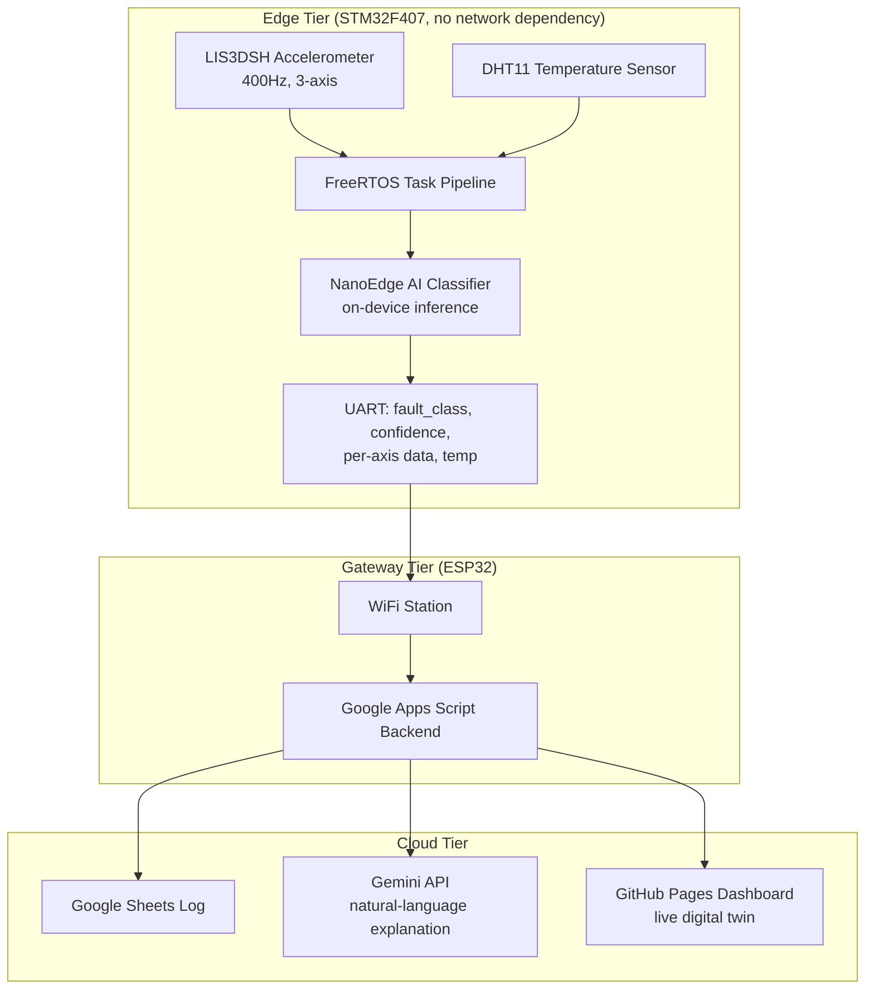

> ✍️ **Note:** This full technical writeup, covering every architecture decision, bug, and fix, is being finalized and will be published here shortly. The system itself is complete and the **[live dashboard](https://shrutik-kapatel.github.io/SpinDoctor/)** is up and running. An accompanying LinkedIn deep-dive is also on the way.

# SpinDoctor — Full Technical Writeup

*Coming soon. In the meantime, see the [project overview](README.md) and the [live dashboard](https://shrutik-kapatel.github.io/SpinDoctor/).*

# SpinDoctor: Technical Writeup

This document is the full engineering log for SpinDoctor: every architecture decision, bug found, and fix made, from raw sensor data to a deployed on-device AI model to a live cloud-connected dashboard.

For a high-level, recruiter-facing overview, see **[README.md](README.md)**.

## Table of Contents

1. [Overview](#overview)
2. [Architecture](#architecture)
3. [Hardware](#hardware)
4. [Groundwork Before the Capstone](#groundwork-before-the-capstone)
5. [Firmware Architecture (STM32 Side)](#firmware-architecture-stm32-side)
6. [The FFT Detour](#the-fft-detour)
7. [Hardening Arc](#hardening-arc)
8. [Data Capture Pipeline](#data-capture-pipeline)
9. [Model Training (NanoEdge AI Studio)](#model-training-nanoedge-ai-studio)
10. [On-Device Inference Integration](#on-device-inference-integration)
11. [ESP32 Gateway](#esp32-gateway)
12. [Cloud Integration: Gemini + Apps Script + Sheets](#cloud-integration-gemini--apps-script--sheets)
13. [Dashboard](#dashboard)
14. [Proof of Work](#proof-of-work)
15. [Known Limitations and What's Left](#known-limitations-and-whats-left)
16. [Lessons Learned](#lessons-learned)
17. [Repository Structure](#repository-structure)
18. [How to Build / Run It](#how-to-build--run-it)
19. [Appendix](#appendix)

---
## Overview

SpinDoctor is a two-tier edge-to-cloud predictive maintenance system. A table fan stands in for real rotating industrial machinery (motors, pumps, compressors), and the system detects three operating states in real time using only vibration and temperature data:

- **Healthy** - normal operation
- **Blade imbalance** - an early-stage mechanical fault, often the first sign of wear before real damage occurs
- **Obstruction** - something physically blocking or dragging on the fan

The core design constraint driving every decision in this project: **fault detection must work entirely on-device**, with zero dependency on network connectivity. The cloud layer (Gemini explanation, Google Sheets logging, live dashboard) exists to make the result useful to a human, but it is not on the critical path for detecting the fault itself. This mirrors how real industrial predictive maintenance systems are designed, edge sensors and controllers cannot depend on a live internet connection to keep machinery safe.

### System diagram

### Why a fan

Access to real industrial rotating equipment for iterative fault-injection testing isn't realistic for a solo capstone project. A table fan provides the same fundamental physics, a rotating mass whose vibration signature changes predictably under imbalance or obstruction, in a form that's safe, cheap to experiment on, and fast to iterate with. The sensor pipeline, model architecture, and edge/cloud split built here transfer directly to a real industrial sensor node; only the physical mounting and fault-injection method would change.
## Architecture

### The two-tier split

SpinDoctor is deliberately split into two independent compute tiers rather than one chip doing everything:

| | STM32F407 (Edge) | ESP32 (Gateway) |
|---|---|---|
| **Responsibility** | Sensing, classification, safety | Connectivity, cloud calls, logging |
| **Depends on network?** | No | Yes |
| **Runs an OS?** | FreeRTOS (real-time) | FreeRTOS (via ESP-IDF, best-effort) |
| **Failure mode if it goes down** | Fault detection stops entirely | Only explanations/dashboard/logging pause |

This split exists because these two jobs have fundamentally different reliability requirements. Classification has to run predictably, every sample, every window, regardless of whether WiFi is up, a coffee shop's router just rebooted, or an API is rate-limited. Networking, by contrast, is inherently best-effort, retries, timeouts, and occasional failures are normal and acceptable. Putting both on one chip would mean a WiFi hiccup could stall or jitter the time-critical sensing loop. Splitting them means the STM32 never even knows the network exists.

### Data flow

1. **LIS3DSH** streams 3-axis acceleration via SPI+DMA at 400Hz, triggered by a data-ready interrupt
2. **DHT11** streams temperature on a slower, independent cycle
3. Both feed into a **FreeRTOS task pipeline** on the STM32 (full detail in [Section 5](#firmware-architecture-stm32-side))
4. Every 64-sample window, the on-device **NanoEdge AI classifier** produces a fault class and confidence score
5. The result, plus raw per-axis data and temperature, is packed into a JSON line and sent over **UART** to the ESP32
6. The ESP32 forwards this to a **Google Apps Script** backend, which logs it to **Google Sheets** and, on request, asks **Gemini** for a plain-language explanation
7. A **GitHub Pages dashboard** polls the Sheets backend and renders the live state, including a real-time animated "digital twin" of the fan

### Why UART between the two chips

A direct wired UART link (rather than, say, both chips on the same WiFi network talking over sockets) was chosen so the STM32's output is a single, simple, always-available interface regardless of the ESP32's network state. The STM32 doesn't need to know if the ESP32 is connected, booted, or even present, it just writes to UART. This decision is what makes the "STM32 doesn't know the network exists" property in the table above actually true, not just aspirational.
